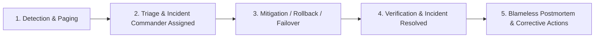

# Incident Response and Blameless Postmortems

Outages are inevitable in complex distributed systems. How organizations respond to incidents and learn from them separates resilient engineering teams from fragile ones.

---

## 1. The Incident Command System (ICS) Roles

During a major Sev-1 outage, clear roles prevent chaotic parallel actions:
- **Incident Commander (IC)**: Owns the incident. Directs the response, delegates investigation tasks, and has final authority on rollbacks or failovers. Does NOT write code or debug.
- **Operations Lead**: Technical lead investigating logs, executing commands, and applying mitigations.
- **Communications Lead**: Updates external status pages (Statuspage.io) and internal executive stakeholders every 15-30 minutes.

---

## 2. Principles of Blameless Postmortems

Pioneered by John Allspaw and Google SRE:
- **Assume Good Intent**: Engineers do not come to work to break production. Failures are systemic defects in tooling, guardrails, automated testing, or process.
- **Eliminate "Human Error"**: If a command typo deleted production data, the root cause is not "operator typed wrong command"—the root cause is *lack of role-based confirmation guards or read-only staging tooling*.
- **The "5 Whys" Technique**: Drill down past superficial symptoms to systemic flaws.

---

## 3. Key Takeaways

- First priority during an incident is **mitigation** (rollback, traffic shed, failover), not debugging root causes.
- Conduct blameless postmortems within 48 hours of every major outage.
- Track all postmortem action items in issue trackers with assigned owners and deadlines.
