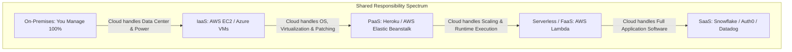

# Cloud Computing Models: IaaS, PaaS, SaaS, and Hybrid Cloud

Cloud computing delivers on-demand computing services over the internet on a pay-as-you-go pricing model. Understanding the shared responsibility model across cloud service tiers is fundamental to modern system design.



---

## 1. Comparing Cloud Service Models

| Model | What You Manage | What Provider Manages | Control Level | Operational Overhead |
| :--- | :--- | :--- | :--- | :--- |
| **IaaS** | OS, Runtime, Middleware, Data, App | Physical hardware, networking, hypervisor | Maximum | High |
| **PaaS** | Application code, Data, Configurations | OS, Runtime, Auto-patching, Hardware | Medium | Low |
| **Serverless** | Function code, Event triggers | Runtime, Instant scaling, Infrastructure | Focused | Near Zero |
| **SaaS** | User accounts, Access policies | Entire application, Storage, Security | Minimal | Zero |

---

## 2. Multi-Cloud vs Hybrid Cloud Strategies

```mermaid
graph TD
    subgraph "Hybrid Cloud"
        HQ[On-Premises Private Data Center: Legacy Core] <-->|AWS Direct Connect (Dedicated 10Gbps Fiber)| Cloud1[AWS Public Cloud VPC]
    end

    subgraph "Multi-Cloud (Best-of-Breed vs Reality)"
        App[Application Workload]
        App --> AWS[AWS for S3 / EKS]
        App --> GCP[GCP for BigQuery / TPU AI]
        Note over AWS,GCP: Risk: Egress data transfer fees ($0.09/GB) create massive cost traps!
    end
```

### The Multi-Cloud Reality:
While multi-cloud promises vendor independence, abstracting across AWS, GCP, and Azure often forces architectures to the "lowest common denominator," sacrificing managed cloud-native superpowers. Best practice: Choose one primary cloud provider and utilize specialized secondary clouds only for distinctive advantages (e.g., GCP for BigQuery/ML).

---

## 3. Key Takeaways

- Balance operational overhead against architectural control: default to managed PaaS/Serverless unless scale dictates IaaS.
- Beware of cloud egress costs when architecting multi-cloud data flows.
- Enforce the Shared Responsibility Model to ensure your security controls cover what the cloud provider does not.
