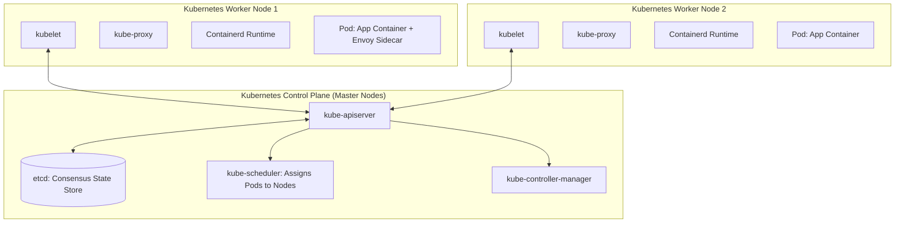
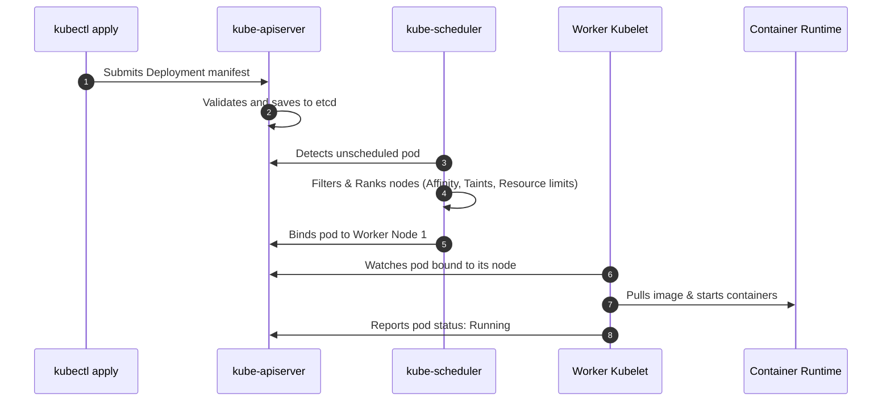

# Containers and Kubernetes Architecture

Containerization packages application code with all dependencies, libraries, and runtime binaries into an immutable container image. Kubernetes (K8s) automates the deployment, scaling, and operational management of containerized workloads.

---

## 1. Core Kubernetes Building Blocks

- **Pod**: The smallest deployable computing unit. Pods encapsulate one or more containers that share storage (volumes), network IP, and localhost namespace.
- **Deployment**: Declarative specification managing replica sets, rolling updates, and rollbacks.
- **Service**: Abstraction defining a logical set of Pods and a policy to access them (ClusterIP, NodePort, LoadBalancer).
- **Ingress**: Manages external HTTP/HTTPS routing into services (e.g., NGINX Ingress, Traefik).

---

## 2. Pod Lifecycle and Scheduling Mechanics

---

## 3. Key Takeaways

- Use Deployments for stateless services and StatefulSets for databases requiring persistent identity and storage.
- Always define CPU and Memory `requests` and `limits` to prevent noisy neighbors from triggering kernel OOM kills.
- Use `readinessProbes` and `livenessProbes` to enable zero-downtime rolling updates.
