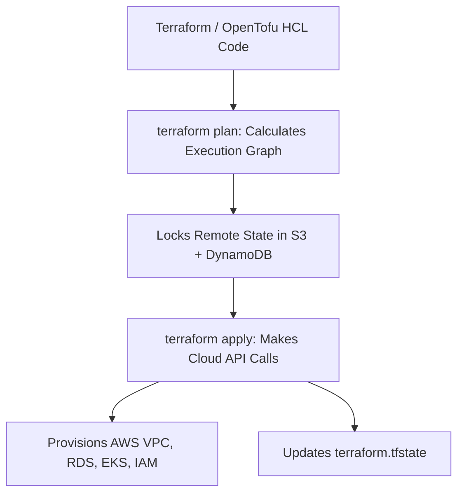

# Infrastructure as Code (IaC): Terraform and GitOps

Infrastructure as Code (IaC) is the practice of provisioning and managing computing infrastructure using declarative configuration definitions rather than manual console clicks.

---

## 1. Declarative vs Imperative IaC

| Dimension | Declarative (Terraform, Pulumi, CloudFormation) | Imperative (Bash, AWS CLI, Python SDK) |
| :--- | :--- | :--- |
| **Paradigm** | You declare **what** the final state should look like | You write step-by-step instructions on **how** to create it |
| **Idempotency** | Native ($N$ executions yield identical state) | Requires manual checks and scripting logic |
| **Drift Detection** | Automatic comparison of live cloud state vs code | Difficult / Manual |
| **Dependency Graph**| Computes DAG automatically for parallel provisioning | Developer must order execution manually |

---

## 2. State Management and Race Conditions

Terraform relies on a state file (`terraform.tfstate`) to map real-world cloud resources to code.
- **Remote State**: Store state in remote object storage (AWS S3, GCS) with encryption at rest.
- **State Locking**: Use a distributed lock (DynamoDB, Consul) to prevent two engineers or CI pipelines from running `apply` concurrently, which corrupts infrastructure state.

---

## 3. Key Takeaways

- Never click manually in cloud provider consoles for production resources; everything must be in IaC.
- Keep Terraform modules small and decoupled to reduce blast radius and state-locking contention.
- Store sensitive variables in secret vaults rather than plain text in Terraform repositories.
