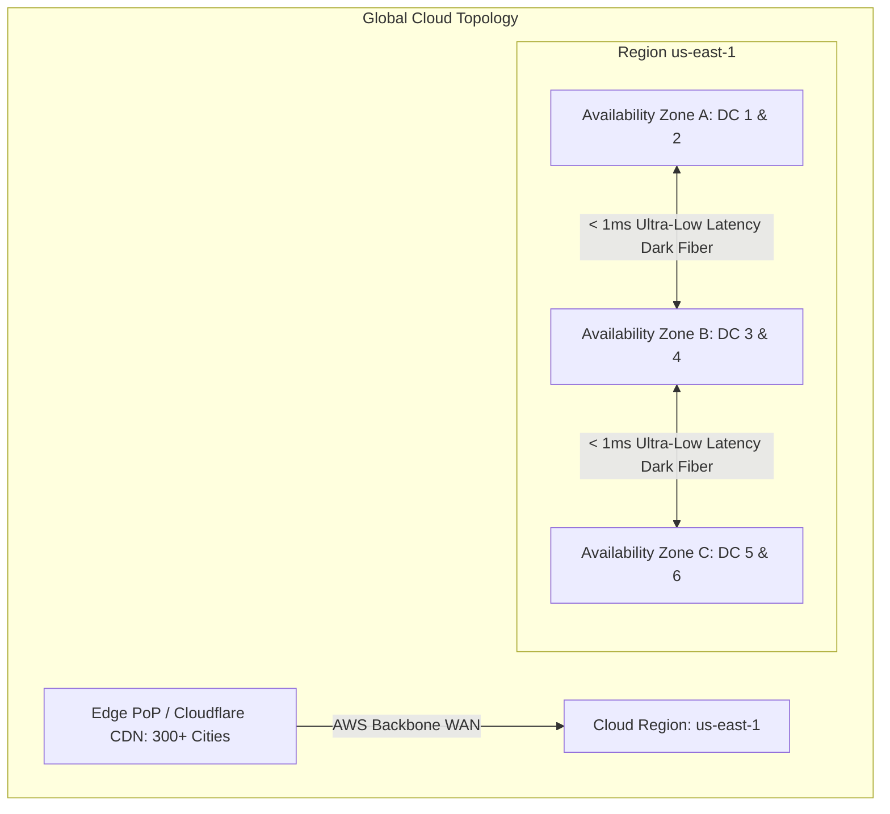

# Regions, Availability Zones, and Edge Locations

Cloud physical architecture is organized hierarchically into Regions, Availability Zones, and Edge Points of Presence (PoPs) to balance latency, redundancy, and disaster recovery.

---

## 1. Physical Infrastructure Definitions

- **Edge PoP**: Lightweight cache and routing nodes located in major metropolitan areas close to end users. Handles TLS termination, static asset caching, and DDoS mitigation.
- **Availability Zone (AZ)**: One or more discrete physical data centers with redundant power, networking, and cooling. Separated by meaningful physical distance (miles) to protect against localized disasters, but close enough (< 1ms) for synchronous replication.
- **Region**: A geographic area containing 3 or more isolated AZs connected via dedicated low-latency fiber networks.

---

## 2. Intra-Region vs Cross-Region Latency & Cost

| Traffic Type | Latency | Data Transfer Cost | Typical Usage |
| :--- | :--- | :--- | :--- |
| **Intra-AZ** | < 0.1ms | Free | Communication within same subnet |
| **Cross-AZ (Same Region)** | ~1ms | $0.01 / GB | Synchronous DB replication, High Availability |
| **Cross-Region (WAN)** | 30ms - 150ms | $0.02 - $0.09 / GB | Disaster recovery, Global data replication |

---

## 3. Key Takeaways

- Deploy workloads across a minimum of 3 Availability Zones to survive data center-level hardware disasters.
- Understand cross-AZ data transfer costs; high-throughput chatty microservices can generate massive bills if placed across AZs unnecessarily.
- Terminate TLS and serve static assets at Edge PoPs to cut end-user perceived latency by 70%+.
