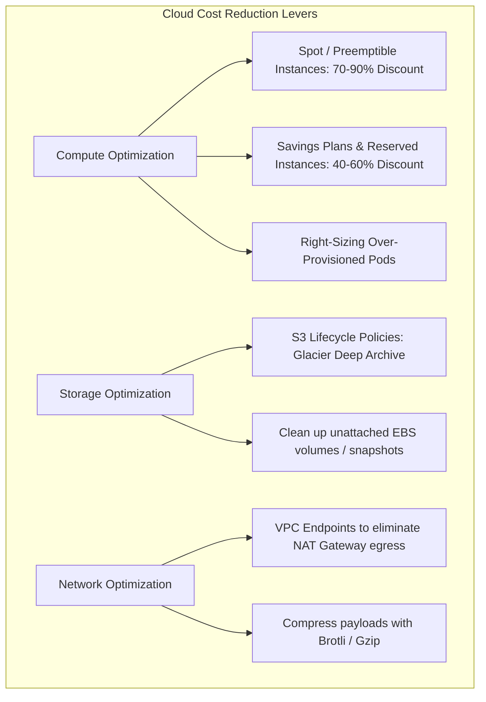
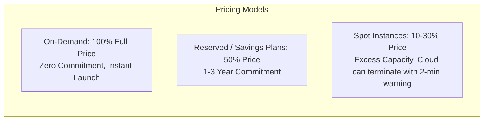

# Cloud Cost Optimization (FinOps)

FinOps brings financial accountability to cloud infrastructure. Without guardrails, autoscaling and unmonitored resources lead to catastrophic cloud bills.

---

## 1. Compute Savings: Spot vs Reserved vs On-Demand

- **Spot Instances**: Perfect for stateless worker pools, CI/CD runners, batch processing, and ML training jobs that tolerate interruption.
- **Reserved Instances / Savings Plans**: Commit to a baseline hourly spend ($/hr) for predictable 24/7 databases and core services.

---

## 2. The NAT Gateway Egress Trap

One of the most common surprise AWS bills:
- Sending traffic from private subnets to AWS S3 through a public NAT Gateway costs **$0.045/GB** for NAT processing plus standard egress fees.
- **Solution**: Provision a free **AWS S3 VPC Gateway Endpoint**. Traffic stays on internal AWS routing at $0.00 cost!

---

## 3. Key Takeaways

- Combine Reserved/Savings Plans for baseline load and Spot instances for elastic batch workloads.
- Enforce lifecycle rules on object storage to transition cold data to Glacier automatically.
- Use VPC Gateway Endpoints for AWS services to eliminate unnecessary NAT Gateway transfer costs.
