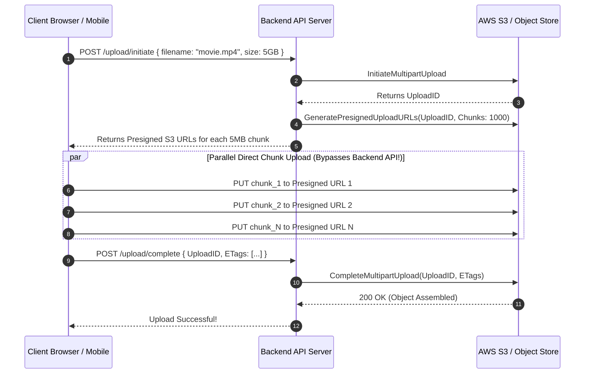

# Blob Storage and Large File Transfers

Uploading and serving massive files (gigabytes to terabytes, such as 4K videos or database backups) requires specialized streaming, multipart chunking, and presigned security patterns.

---

## 1. Direct-to-Storage with Presigned URLs

### The Anti-Pattern:
Uploading files through your application backend servers saturates backend network bandwidth, exhausts worker threads, and risks connection timeouts on slow mobile networks.

### The Best Practice:
Generate short-lived (15-minute) **Presigned URLs** with cryptographic signatures. The client uploads data **directly to object storage (S3)**, completely bypassing your application servers.

---

## 2. Multipart Upload Mechanics

For files larger than 100MB, multipart uploads are mandatory:
1. **Parallelism**: Chunks (typically 5MB - 20MB) upload in parallel across multiple TCP sockets, saturating client bandwidth.
2. **Resumability**: If chunk 47 fails due to network drop, only chunk 47 is retried—not the entire 5GB file.
3. **Pipelining**: Uploading can begin while the file is still being generated or recorded on the client device.

---

## 3. Key Takeaways

- Never stream large file uploads or downloads through application backend memory; always use direct-to-storage Presigned URLs.
- Always use Multipart Uploads for files $> 100	ext{MB}$ to support parallel chunking and granular retry.
- Front public blob downloads with a Content Delivery Network (CDN) to cache static media close to users.
