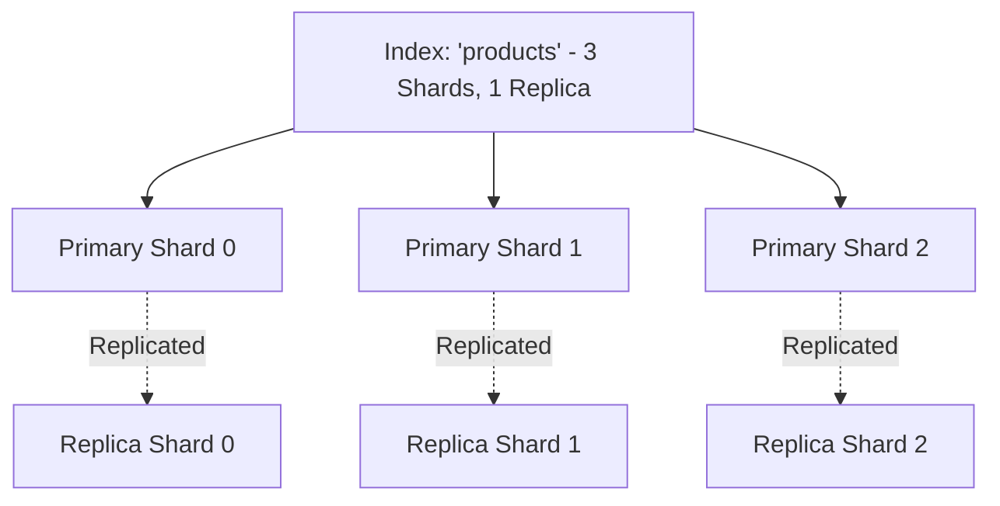

# Full-Text Search and Inverted Indexes

Relational databases use B+Tree indexes, which fail on text search queries containing wildcard substrings (`WHERE text LIKE '%system%'`) because they require full sequential table scans. Search engines (Elasticsearch, OpenSearch) solve this using **Inverted Indexes**.

```mermaid
graph TD
    Doc1["Doc 1: 'Distributed systems are scalable'"]
    Doc2["Doc 2: 'Scalable systems require monitoring'"]

    subgraph Text Analysis Pipeline
        Tokenize[Tokenizer: Lowercase & Split words]
        Filter[Filter: Remove Stop Words ('are')]
        Stem[Stemming: 'scalable' -> 'scale']
    end

    Doc1 --> Tokenize
    Doc2 --> Tokenize
    Tokenize --> Filter --> Stem --> InvertedIndex

    subgraph "Inverted Index (Posting Lists)"
        Term1["'distribut' -> [Doc 1]"]
        Term2["'scale'      -> [Doc 1, Doc 2]"]
        Term3["'system'     -> [Doc 1, Doc 2]"]
        Term4["'monitor'    -> [Doc 2]"]
    end
```

---

## 1. Anatomy of an Inverted Index

An Inverted Index maps every unique word (term) to a sorted list of document IDs where it appears (the **Posting List**):

### Fast Boolean Queries:
To execute: `scale AND monitor`:
1. Fetch posting list for `scale`: `[Doc 1, Doc 2]`
2. Fetch posting list for `monitor`: `[Doc 2]`
3. Compute intersection using two-pointer scan: $\implies \mathbf{[Doc 2]}$ (Sub-millisecond execution over millions of docs!).

---

## 2. Relevance Scoring: TF-IDF vs BM25

Modern search engines rank documents using **BM25 (Best Matching 25)**:
- **Term Frequency (TF)**: How often does the word appear in this document? (With saturation to prevent keyword stuffing).
- **Inverse Document Frequency (IDF)**: How rare is this word across all documents? Rare words ("Kubernetes") carry vastly more weight than common words ("computer").
- **Document Length Normalization**: Shorter documents matching the term receive higher ranking than long documents.

---

## 3. Elasticsearch Distributed Architecture



- **Query Phase**: The coordinating node broadcasts the search query to all shards (primary or replica). Each shard computes local BM25 top-K results.
- **Fetch Phase**: Coordinating node merges priority queues, requests full document sources for the top $K$, and returns to client.

---

## 4. Key Takeaways

- Inverted indexes turn text search from an $O(N)$ full table scan into an $O(1)$ dictionary lookup and posting list intersection.
- Use BM25 scoring for human-like relevance ranking.
- Synchronize search engines with relational databases asynchronously using CDC (Debezium) to prevent dual-write inconsistencies.
