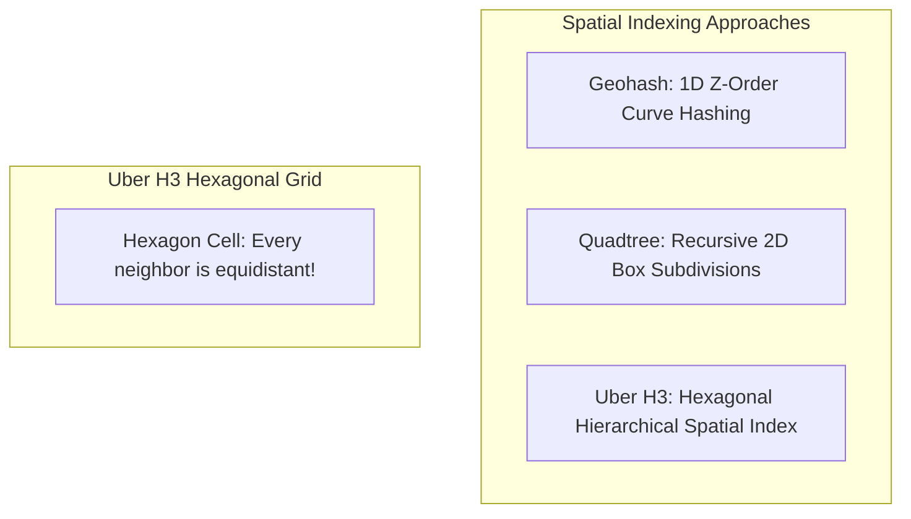
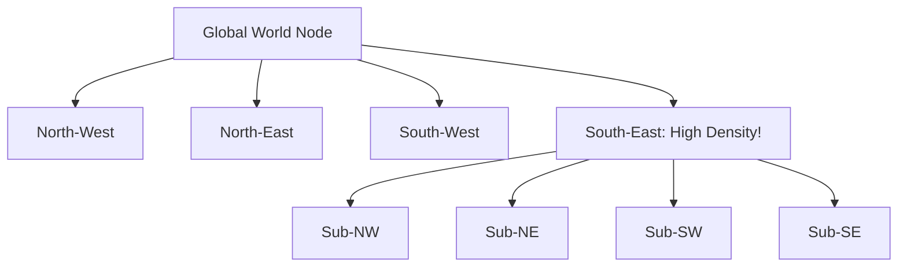

# Geospatial Indexing: Geohash, Quadtree, and Uber H3

Querying physical locations ("Find the 10 closest drivers within 3 km of latitude 37.77, longitude -122.41") requires specialized 2D geospatial indexing structures.

---

## 1. The 2D B-Tree Problem

Relational B+Tree indexes are 1-dimensional. An index on `(latitude, longitude)` can efficiently filter by `latitude`, but must scan all matching rows to filter by `longitude`. Querying bounding boxes becomes slow and inefficient.

---

## 2. Geospatial Indexing Strategies

### 1. Geohash
- Interleaves bits of latitude and longitude into a Base32 string (e.g., `9q8yy`).
- **Prefix Matching**: Shared prefix means spatial proximity. All points in `9q8yy` are inside the same $pprox 5	ext{km} 	imes 5	ext{km}$ box.
- *Edge Case*: Boundary discontinuity at the Prime Meridian and Equator.

### 2. Quadtree
- Recursively divides a 2D bounding space into 4 quadrants (NW, NE, SW, SE) when point density exceeds a threshold (e.g., 100 drivers per node).
- Dynamically adapts to density: downtown Manhattan has deep quadtree branches; rural deserts have shallow nodes.

### 3. Uber H3 (Hexagonal Grid)
- Partitions the globe into hexagonal cells across 16 hierarchical resolutions.
- **Why Hexagons?** Unlike squares where diagonal neighbors are $\sqrt{2} 	imes$ farther than adjacent neighbors, **every neighbor in a hexagonal grid is exactly equidistant**. This property makes radius searches and routing algorithms drastically simpler.

---

## 3. Key Takeaways

- Use **Uber H3** for ride-sharing, food delivery, and spatial dispatch due to equidistant hexagonal neighbor math.
- Use **Geohashes** in relational or KV stores (Redis `GEOADD`) for simple prefix-based radius lookups.
- Use **Quadtrees** in-memory when managing highly dynamic, non-uniform spatial point density.
