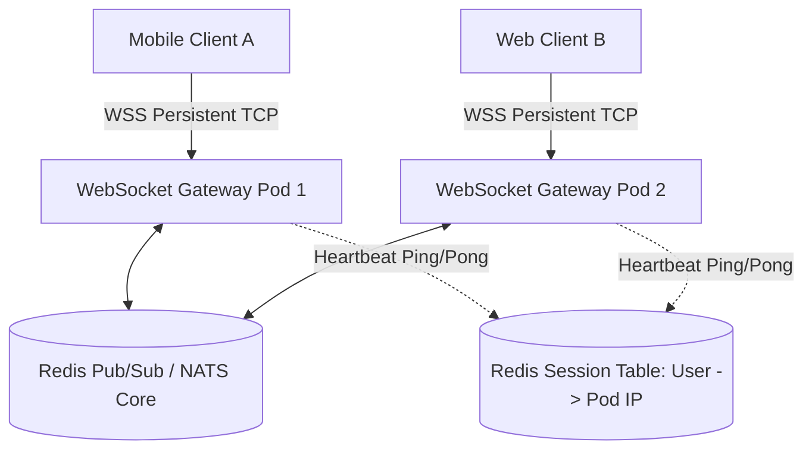
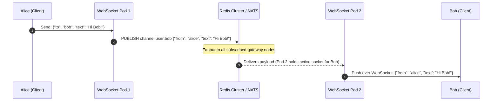

# Real-Time Communication Architecture: WebSockets at Scale

Architecting systems to maintain millions of persistent, bidirectional, low-latency TCP connections (WebSockets) requires solving connection statefulness, edge proxy termination, and distributed message routing.

---

## 1. The Stateful Connection Challenge

Unlike stateless HTTP requests where any backend pod can fulfill any request, a WebSocket connection pins the client to a specific server instance for hours or days.

### Scaling Bottlenecks:
1. **File Descriptors (FD Limits)**: Every TCP socket consumes an OS file descriptor. Kernel tuning (`sysctl -w fs.file-max=2097152`, `ulimit -n 1048576`) is mandatory.
2. **RAM per Connection**: A kernel TCP socket buffer and TLS state consumes 4KB - 16KB of RAM. 1 million concurrent connections require $pprox 10	ext{GB} - 16	ext{GB}$ of pure memory just to maintain idle sockets.
3. **Cross-Server Routing**: When User A (connected to Pod 1) sends a chat message to User B (connected to Pod 2), Pod 1 cannot write to Pod 2's local memory.

---

## 2. Distributed Message Routing with Pub/Sub

To route messages between arbitrary gateway pods:

---

## 3. Connection Lifecycles: Heartbeats and Reconnection Thundering Herds

- **Heartbeats (Ping/Pong)**: Fire every 30-60 seconds. Proxies (AWS ALB, Cloudflare) close idle TCP connections after 60-120 seconds.
- **Thundering Herd on Gateway Restart**: When a gateway node crashes, 50,000 clients attempt to reconnect simultaneously.
  - *Fix*: Mandatory **exponential backoff with full jitter** on client reconnect loops.

---

## 4. Key Takeaways

- Terminate WebSockets at dedicated, lightweight gateway edge clusters.
- Use high-throughput messaging backbones (Redis Pub/Sub, NATS, Kafka) to route messages across connection pods.
- Tune OS kernel file descriptors and socket buffer limits to support 100K+ concurrent connections per server.
