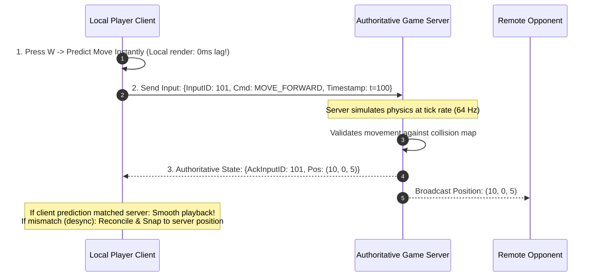
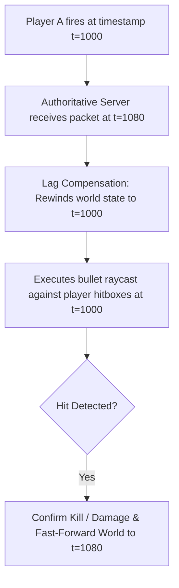

# Multiplayer Game Networking: Client Prediction and Lag Compensation

Real-time multiplayer games (FPS, battle royale) operate under stringent physics budgets where network round-trip times (50ms - 150ms) are intolerable without deterministic prediction and server reconciliation.

---

## 1. The Authoritative Server Model

Clients are never trusted. A client that sends "My position is now (X, Y, Z)" enables instant teleportation hacks and speed cheats.
- **Rule**: Clients send **inputs only** (keystrokes, mouse deltas, timestamp).
- The server runs the authoritative simulation loop (e.g., at 64Hz or 128Hz) and broadcasts ground-truth world snapshots.

---

## 2. Lag Compensation: "Rewind Time"

When Player A shoots Player B who is sprinting across the screen:
- Because of 80ms network latency, Player A aimed at where Player B was on Player A's screen 80ms ago.
- Without compensation, the server would calculate Player B has already moved past that coordinate, resulting in a frustrating missed shot.

---

## 3. Key Takeaways

- Use authoritative dedicated game servers communicating over custom UDP protocols (not TCP).
- Implement client-side prediction to make local movement feel instantaneous.
- Implement server lag compensation by buffering recent historical hitboxes and rewinding world state upon input arrival.
