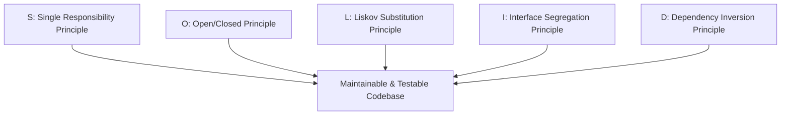

# SOLID Principles with Production Code Examples

The SOLID principles, introduced by Robert C. Martin (Uncle Bob), provide the foundation for writing maintainable, extensible, and understandable object-oriented code.



---

## 1. Single Responsibility Principle (SRP)
> *"A class should have one, and only one, reason to change."*

### Anti-Pattern:
A class that handles business calculations, database persistence, and HTML formatting:
```python
# VIOLATION of SRP
class Invoice:
    def __init__(self, amount):
        self.amount = amount

    def calculate_total(self):
        return self.amount * 1.20 # Tax

    def save_to_database(self):
        db.execute("INSERT INTO invoices VALUES (?)", self.amount)

    def print_html_report(self):
        return f"<div>Invoice: ${self.amount}</div>"
```

### Refactored (Adhering to SRP):
```python
class Invoice:
    def __init__(self, amount: float):
        self.amount = amount

    def calculate_total(self) -> float:
        return self.amount * 1.20

class InvoiceRepository:
    def save(self, invoice: Invoice):
        db.execute("INSERT INTO invoices VALUES (?)", invoice.amount)

class InvoiceHtmlFormatter:
    def format(self, invoice: Invoice) -> str:
        return f"<div>Invoice: ${invoice.amount}</div>"
```

---

## 2. Open/Closed Principle (OCP)
> *"Software entities should be open for extension, but closed for modification."*

Add new behavior by writing new classes, not by modifying and adding `if/else` ladders to existing tested classes.

```python
from abc import ABC, abstractmethod

class PaymentProcessor(ABC):
    @abstractmethod
    def pay(self, amount: float):
        pass

class StripePaymentProcessor(PaymentProcessor):
    def pay(self, amount: float):
        stripe_api.charge(amount)

class PayPalPaymentProcessor(PaymentProcessor):
    def pay(self, amount: float):
        paypal_api.charge(amount)

# To add ApplePay: create ApplePayProcessor class WITHOUT altering PaymentProcessor!
```

---

## 3. Liskov Substitution Principle (LSP)
> *"Subtypes must be substitutable for their base types without altering program correctness."*

### Classic Violation: Square Inheriting from Rectangle
```python
class Rectangle:
    def set_width(self, w): self.width = w
    def set_height(self, h): self.height = h
    def area(self): return self.width * self.height

class Square(Rectangle):
    def set_width(self, w):
        self.width = self.height = w # Mutates height unexpectedly!
```
*Fix*: Make `Shape` the base interface with an `area()` method; do not inherit Square from Rectangle.

---

## 4. Interface Segregation Principle (ISP)
> *"Clients should not be forced to depend upon interfaces that they do not use."*

Favor many small, client-specific role interfaces over one bloated general-purpose interface.

```go
// GOOD: Small, segregated interfaces
type Reader interface {
    Read(p []byte) (n int, err error)
}

type Writer interface {
    Write(p []byte) (n int, err error)
}

type ReadWriter interface {
    Reader
    Writer
}
```

---

## 5. Dependency Inversion Principle (DIP)
> *"High-level modules should not depend on low-level modules. Both should depend on abstractions."*

High-level business use cases must not directly instantiate SQL database connections or third-party SDKs; inject interfaces via constructors.

---

## 6. Key Takeaways

- Apply SRP to keep classes focused and testable.
- Use polymorphism and Strategy patterns to uphold OCP.
- Avoid inheritance traps that violate LSP; prefer composition over inheritance.
- Design narrow interfaces (ISP) and inject abstractions (DIP).
