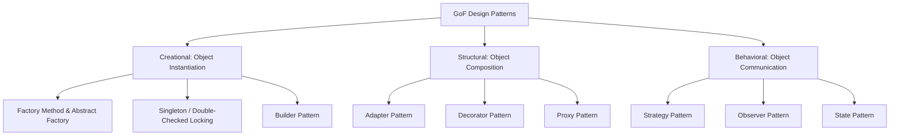
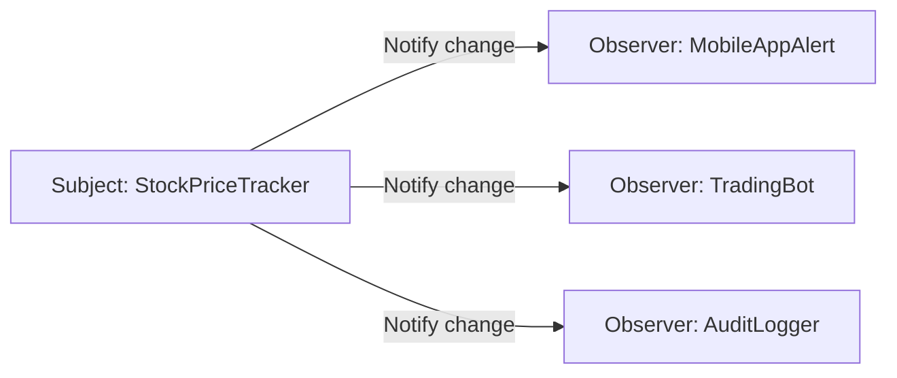

# Gang of Four (GoF) Design Patterns

The 23 classic software design patterns documented by the "Gang of Four" (Erich Gamma, Richard Helm, Ralph Johnson, John Vlissides) are divided into Creational, Structural, and Behavioral categories.



---

## 1. Top Patterns in System Design

### 1. Strategy Pattern (Behavioral)
Defines a family of interchangeable algorithms at runtime:
```python
from abc import ABC, abstractmethod

class PricingStrategy(ABC):
    @abstractmethod
    def calculate_price(self, base_price: float) -> float:
        pass

class RegularPricing(PricingStrategy):
    def calculate_price(self, base_price: float) -> float:
        return base_price

class SurgePricing(PricingStrategy):
    def calculate_price(self, base_price: float) -> float:
        return base_price * 1.5

class RideFareCalculator:
    def __init__(self, strategy: PricingStrategy):
        self.strategy = strategy

    def get_fare(self, distance: float) -> float:
        base = distance * 2.0
        return self.strategy.calculate_price(base)
```

---

### 2. Observer Pattern (Behavioral)
Publish/subscribe mechanism for in-memory event notifications:


---

### 3. Decorator Pattern (Structural)
Attaches additional responsibilities dynamically without modifying underlying classes:
```python
class Coffee(ABC):
    @abstractmethod
    def cost(self) -> float: pass

class SimpleCoffee(Coffee):
    def cost(self) -> float: return 2.0

class MilkDecorator(Coffee):
    def __init__(self, coffee: Coffee):
        self._coffee = coffee
    def cost(self) -> float:
        return self._coffee.cost() + 0.5
```

---

## 2. Key Takeaways

- Use **Strategy** to swap business rules dynamically (discounts, route calculation, compression).
- Use **Decorator** to wrap cross-cutting behavior (rate limiting, logging, retry wrappers).
- Use **Observer** for decoupled in-memory event handling.
