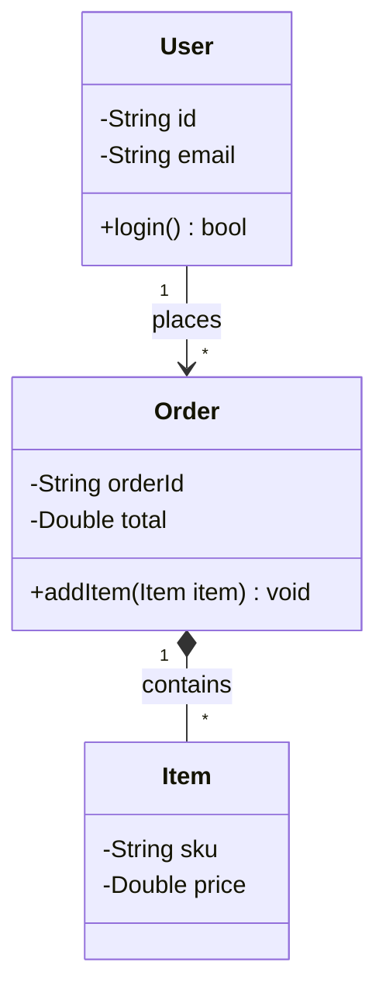
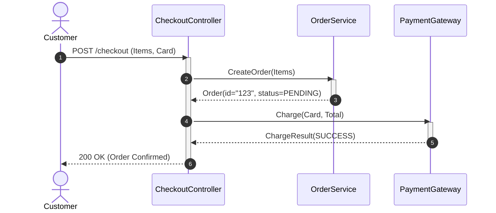

# UML Diagrams: Class and Sequence Diagrams

Unified Modeling Language (UML) provides standard visual notations for modeling software structure and runtime interaction workflows.

---

## 1. Class Diagram Relationships

| Notation | Relationship | Meaning | Example |
| :--- | :--- | :--- | :--- |
| `-->` | **Association** | One class uses or references another | `User` uses `PaymentService` |
| `--*` | **Composition** | Strong "part-of" whole; lifetime bound | `Order` owns `LineItems` (if order dies, items die) |
| `--o` | **Aggregation** | Weak "has-a" relationship; independent life | `Department` has `Employees` (employees survive) |
| `..|>` | **Realization** | Class implements an interface | `PostgresRepo` implements `Repository` |
| `--|>` | **Inheritance** | Class extends a parent class | `CreditCard` extends `PaymentMethod` |

---

## 2. Sequence Diagrams: Runtime Interactions

Sequence diagrams depict object lifecycles, method invocations, and synchronous vs asynchronous message passing:

---

## 3. Key Takeaways

- Class diagrams visualize static system structure and dependency coupling.
- Sequence diagrams capture runtime execution flow, call hierarchy, and message ordering.
- Use Composition over Aggregation when the child entity cannot exist without the parent container.
