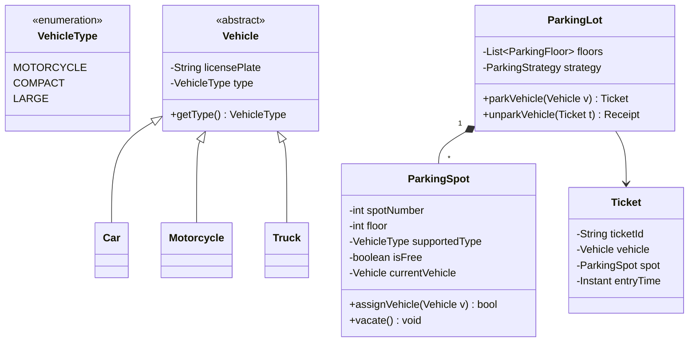

# Worked LLD: Parking Lot System

A complete Low-Level Design for a multi-floor parking lot supporting different vehicle types, dynamic spot allocation, and payment calculation.



---

## 1. Functional Requirements

1. Multiple floors, with each floor having multiple parking spots.
2. Support distinct vehicle types: Motorcycle, Car (Compact), Truck (Large).
3. Assign closest available spot to entrance.
4. Issue timestamped ticket on entry.
5. Calculate dynamic hourly parking fees on exit based on vehicle type.
6. Thread-safe concurrent entry/exit.

---

## 2. Production Code Implementation (Python)

```python
from enum import Enum
from datetime import datetime
import threading
from typing import Dict, Optional, List

class VehicleType(Enum):
    MOTORCYCLE = 1
    CAR = 2
    TRUCK = 3

class Vehicle:
    def __init__(self, license_plate: str, vehicle_type: VehicleType):
        self.license_plate = license_plate
        self.vehicle_type = vehicle_type

class ParkingSpot:
    def __init__(self, spot_id: int, floor: int, spot_type: VehicleType):
        self.spot_id = spot_id
        self.floor = floor
        self.spot_type = spot_type
        self.is_occupied = False
        self.vehicle: Optional[Vehicle] = None
        self._lock = threading.Lock()

    def assign(self, vehicle: Vehicle) -> bool:
        with self._lock:
            if not self.is_occupied and self.spot_type == vehicle.vehicle_type:
                self.is_occupied = True
                self.vehicle = vehicle
                return True
            return False

    def vacate(self):
        with self._lock:
            self.is_occupied = False
            self.vehicle = None

class Ticket:
    def __init__(self, ticket_id: str, vehicle: Vehicle, spot: ParkingSpot):
        self.ticket_id = ticket_id
        self.vehicle = vehicle
        self.spot = spot
        self.entry_time = datetime.utcnow()

class FeeCalculator:
    RATES = {
        VehicleType.MOTORCYCLE: 1.0,
        VehicleType.CAR: 2.5,
        VehicleType.TRUCK: 5.0
    }

    @classmethod
    def calculate_fee(cls, ticket: Ticket, exit_time: datetime) -> float:
        duration_hours = max(1, int((exit_time - ticket.entry_time).total_seconds() / 3600))
        return duration_hours * cls.RATES[ticket.vehicle.vehicle_type]

class ParkingLot:
    _instance = None
    _lock = threading.Lock()

    def __new__(cls):
        with cls._lock:
            if cls._instance is None:
                cls._instance = super().__new__(cls)
                cls._instance._init_parking_lot()
            return cls._instance

    def _init_parking_lot(self):
        self.spots: List[ParkingSpot] = []
        self.active_tickets: Dict[str, Ticket] = {}
        self.lot_lock = threading.Lock()

    def add_spot(self, spot: ParkingSpot):
        self.spots.append(spot)

    def park(self, vehicle: Vehicle) -> Optional[Ticket]:
        with self.lot_lock:
            for spot in self.spots:
                if spot.assign(vehicle):
                    ticket_id = f"TICK-{vehicle.license_plate}-{int(datetime.utcnow().timestamp())}"
                    ticket = Ticket(ticket_id, vehicle, spot)
                    self.active_tickets[ticket_id] = ticket
                    return ticket
            return None # Lot Full

    def unpark(self, ticket_id: str) -> Optional[float]:
        with self.lot_lock:
            ticket = self.active_tickets.pop(ticket_id, None)
            if not ticket:
                return None
            ticket.spot.vacate()
            return FeeCalculator.calculate_fee(ticket, datetime.utcnow())
```

---

## 3. Thread-Safety and Edge Cases

- **Locking Granularity**: Dual locking ensures thread safety. A coarse lot lock protects ticket dictionaries; fine-grained spot locks prevent race conditions where two cars claim the same spot simultaneously.
- **Lost Ticket Handling**: System allows looking up tickets by license plate in the active ticket hash map.
