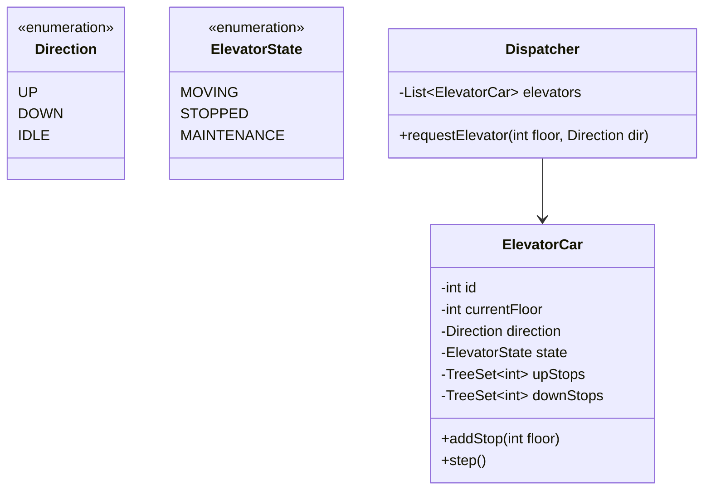

# Worked LLD: Elevator System (Dispatch Controller)

A complete Low-Level Design for a multi-car elevator control system optimizing passenger wait time using the LOOK (SCAN) elevator dispatching algorithm.



---

## 1. Requirements and Dispatch Strategy

- Multiple elevator cars serving $N$ floors.
- Hall calls from floors (Up / Down buttons).
- Internal car destination requests (floor buttons inside car).
- **Dispatch Algorithm**: SCAN / LOOK algorithm (serves all requests in current direction until no more remain, then reverses).

---

## 2. Production Code Implementation (Python)

```python
from enum import Enum
import threading
import time
from typing import List, Set

class Direction(Enum):
    UP = 1
    DOWN = -1
    IDLE = 0

class ElevatorCar:
    def __init__(self, car_id: int):
        self.car_id = car_id
        self.current_floor = 1
        self.direction = Direction.IDLE
        self.up_stops: Set[int] = set()
        self.down_stops: Set[int] = set()
        self._lock = threading.Lock()

    def add_destination(self, floor: int):
        with self._lock:
            if floor > self.current_floor:
                self.up_stops.add(floor)
                if self.direction == Direction.IDLE:
                    self.direction = Direction.UP
            elif floor < self.current_floor:
                self.down_stops.add(floor)
                if self.direction == Direction.IDLE:
                    self.direction = Direction.DOWN

    def step(self):
        with self._lock:
            if self.direction == Direction.UP:
                self.current_floor += 1
                if self.current_floor in self.up_stops:
                    self.up_stops.remove(self.current_floor)
                    self._open_doors()
                if not self.up_stops:
                    self.direction = Direction.DOWN if self.down_stops else Direction.IDLE

            elif self.direction == Direction.DOWN:
                self.current_floor -= 1
                if self.current_floor in self.down_stops:
                    self.down_stops.remove(self.current_floor)
                    self._open_doors()
                if not self.down_stops:
                    self.direction = Direction.UP if self.up_stops else Direction.IDLE

    def _open_doors(self):
        # Open doors for passenger boarding
        pass

class ElevatorDispatcher:
    def __init__(self, elevators: List[ElevatorCar]):
        self.elevators = elevators

    def select_best_elevator(self, floor: int, direction: Direction) -> ElevatorCar:
        # P2C / Proximity Scoring heuristic
        best_car = None
        min_distance = float('inf')

        for car in self.elevators:
            distance = abs(car.current_floor - floor)
            # Bonus score if car is moving toward the floor in same direction
            if car.direction == direction and ((direction == Direction.UP and car.current_floor <= floor) or 
                                               (direction == Direction.DOWN and car.current_floor >= floor)):
                distance -= 2
            elif car.direction == Direction.IDLE:
                distance -= 1

            if distance < min_distance:
                min_distance = distance
                best_car = car

        return best_car or self.elevators[0]

    def press_hall_button(self, floor: int, direction: Direction):
        car = self.select_best_elevator(floor, direction)
        car.add_destination(floor)
```

---

## 3. Key Takeaways

- Separate the Dispatcher (global routing controller) from individual Elevator Cars (local state machines).
- Use sorted sets or bitsets to store stops for the LOOK / SCAN elevator movement algorithm.
- Ensure state transitions are protected with mutexes to prevent concurrent movement corruption.
