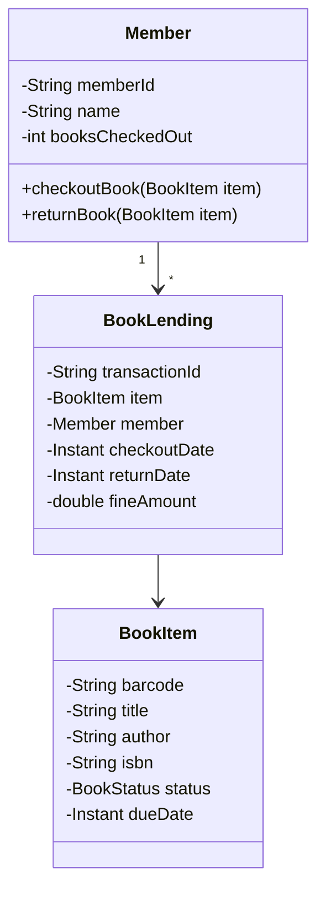

# Worked LLD: Library Management System

A complete Low-Level Design for a Library Management System supporting catalog search, book lending, overdue fines, and member reservations.



---

## 1. Functional Requirements

1. Catalog search by Title, Author, or ISBN.
2. Members can check out at most 5 books at a time.
3. Maximum checkout period is 14 days.
4. Automated overdue fine calculation ($0.50/day overdue).
5. Thread-safe book reservation and checkout.

---

## 2. Production Code Implementation (Python)

```python
from datetime import datetime, timedelta
import threading
from typing import Dict, List, Optional

class BookStatus:
    AVAILABLE = "AVAILABLE"
    LOANED = "LOANED"
    RESERVED = "RESERVED"

class BookItem:
    def __init__(self, barcode: str, isbn: str, title: str, author: str):
        self.barcode = barcode
        self.isbn = isbn
        self.title = title
        self.author = author
        self.status = BookStatus.AVAILABLE
        self.due_date: Optional[datetime] = None
        self._lock = threading.Lock()

class Member:
    MAX_BOOKS = 5

    def __init__(self, member_id: str, name: str):
        self.member_id = member_id
        self.name = name
        self.borrowed_books: Dict[str, BookItem] = {}

    def can_borrow(self) -> bool:
        return len(self.borrowed_books) < self.MAX_BOOKS

class LibraryService:
    DAILY_FINE = 0.50

    def __init__(self):
        self.catalog_by_barcode: Dict[str, BookItem] = {}
        self.catalog_by_title: Dict[str, List[BookItem]] = {}
        self.members: Dict[str, Member] = {}
        self._sys_lock = threading.Lock()

    def checkout_book(self, member_id: str, barcode: str) -> bool:
        with self._sys_lock:
            member = self.members.get(member_id)
            book = self.catalog_by_barcode.get(barcode)

            if not member or not book:
                return False
            if not member.can_borrow():
                return False

            with book._lock:
                if book.status != BookStatus.AVAILABLE:
                    return False
                book.status = BookStatus.LOANED
                book.due_date = datetime.utcnow() + timedelta(days=14)
                member.borrowed_books[barcode] = book
                return True

    def return_book(self, member_id: str, barcode: str) -> float:
        with self._sys_lock:
            member = self.members.get(member_id)
            if not member or barcode not in member.borrowed_books:
                return 0.0

            book = member.borrowed_books.pop(barcode)
            with book._lock:
                fine = 0.0
                if book.due_date and datetime.utcnow() > book.due_date:
                    days_overdue = (datetime.utcnow() - book.due_date).days
                    fine = max(0, days_overdue) * self.DAILY_FINE
                
                book.status = BookStatus.AVAILABLE
                book.due_date = None
                return fine
```

---

## 3. Key Takeaways

- Encapsulate book state transitions within synchronized blocks on the specific book item.
- Enforce business invariants (max 5 books, overdue fines) prior to state modification.
- Maintain separate indices by barcode, title, and author to support multi-attribute search.
