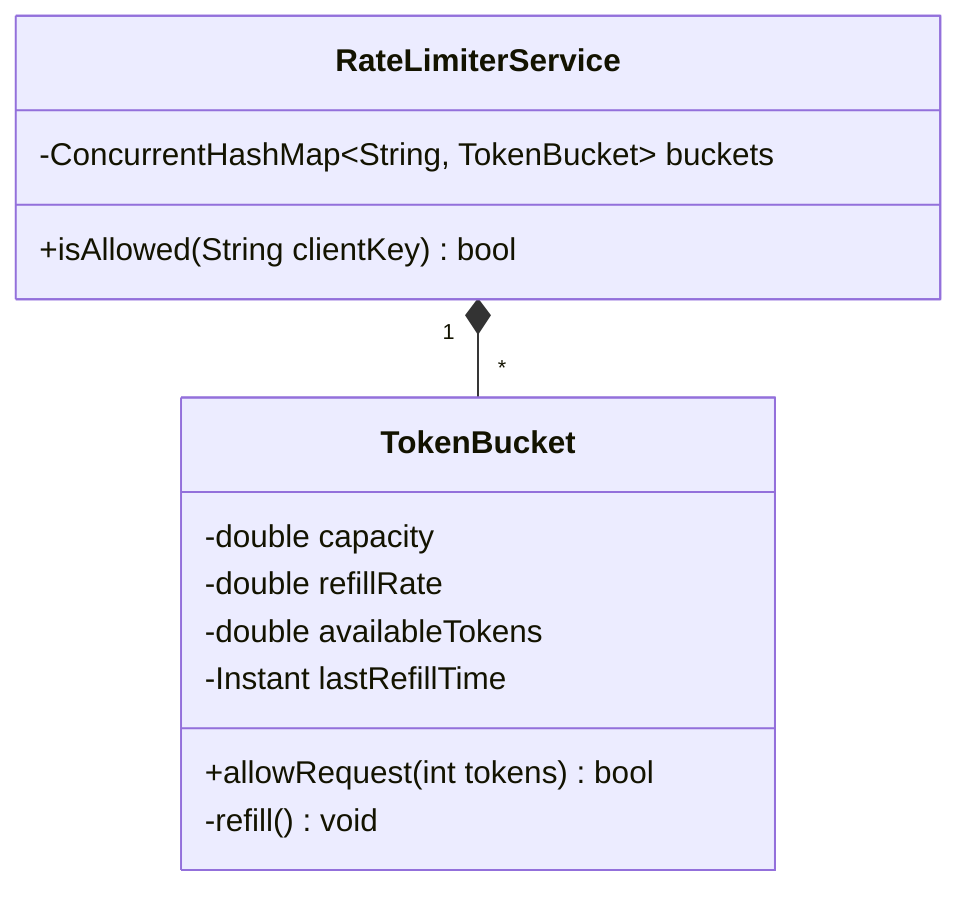

# Worked LLD: In-Memory Rate Limiter (Token Bucket)

A complete Low-Level Design for a thread-safe, high-throughput in-memory Token Bucket rate limiter.



---

## 1. Requirements

1. Token Bucket algorithm: Smooth traffic bursts up to capacity while enforcing steady-state refill rate.
2. Thread-safe execution under multi-threaded concurrency.
3. Memory leak protection: Automatically expire idle client buckets.

---

## 2. Production Code Implementation (Python)

```python
import time
import threading
from typing import Dict

class TokenBucket:
    def __init__(self, capacity: float, refill_rate_per_sec: float):
        self.capacity = capacity
        self.refill_rate = refill_rate_per_sec
        self.tokens = capacity
        self.last_refill_timestamp = time.monotonic()
        self._lock = threading.Lock()

    def allow(self, tokens_needed: int = 1) -> bool:
        with self._lock:
            now = time.monotonic()
            elapsed = now - self.last_refill_timestamp
            self.last_refill_timestamp = now

            # Refill tokens proportional to elapsed time
            self.tokens = min(self.capacity, self.tokens + elapsed * self.refill_rate)

            if self.tokens >= tokens_needed:
                self.tokens -= tokens_needed
                return True
            return False

class RateLimiterService:
    def __init__(self, capacity: float = 10, refill_rate: float = 2):
        self.capacity = capacity
        self.refill_rate = refill_rate
        self.clients: Dict[str, TokenBucket] = {}
        self._global_lock = threading.Lock()

    def is_allowed(self, client_id: str) -> bool:
        with self._global_lock:
            if client_id not in self.clients:
                self.clients[client_id] = TokenBucket(self.capacity, self.refill_rate)
            bucket = self.clients[client_id]
        
        return bucket.allow(1)
```

---

## 3. Key Takeaways

- Lazy evaluation (`time.monotonic()` delta) eliminates the need for expensive background refill timer threads.
- Two-level locking prevents thread contention across different clients.
- Handle Clock Skew by using monotonic timers instead of wall-clock epoch time.
