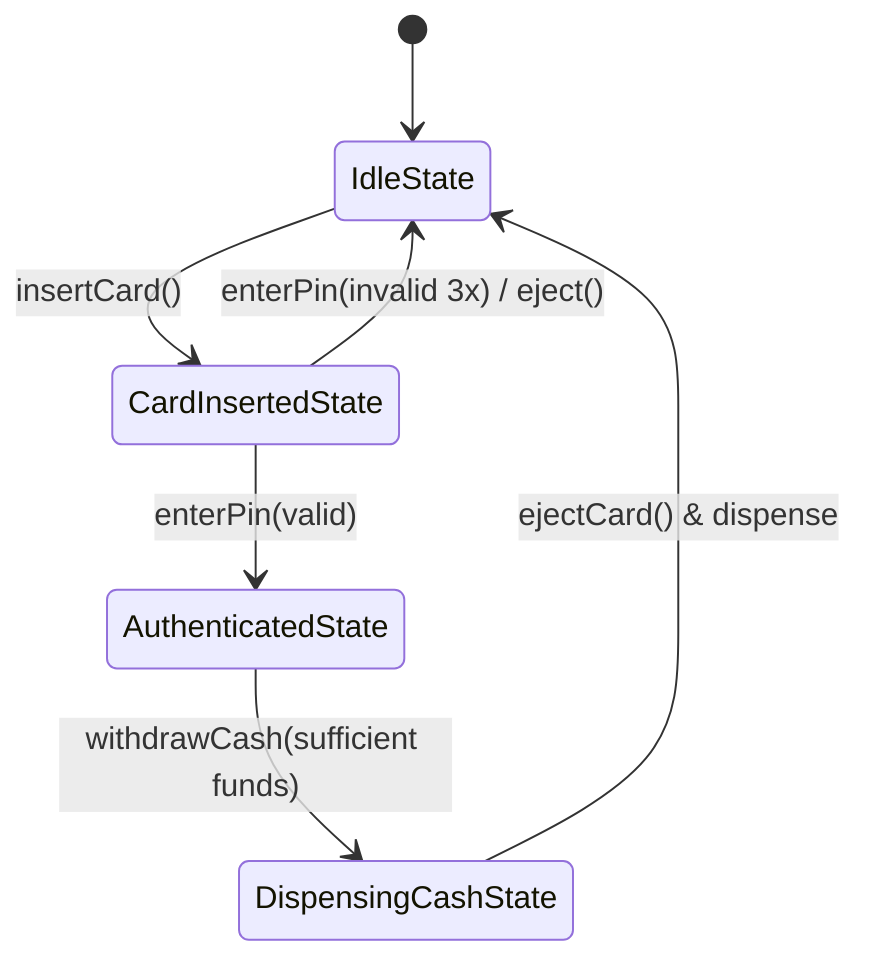

# Worked LLD: ATM System (State Pattern)

A complete Low-Level Design for an Automated Teller Machine (ATM) utilizing the **State Pattern** to manage card validation, PIN verification, cash dispensing, and transactions.



---

## 1. Requirements

1. User inserts card, enters 4-digit PIN (max 3 attempts).
2. Check balance, withdraw cash, deposit cash.
3. Dispense cash in specific bill denominations ($100, $50, $20) using Chain of Responsibility.
4. Support state transitions: Idle $	o$ CardInserted $	o$ Authenticated $	o$ Dispensing.

---

## 2. Production Code Implementation (Python)

```python
from abc import ABC, abstractmethod

class ATM:
    def __init__(self, initial_cash: int):
        self.cash = initial_cash
        self.card = None
        self.pin_attempts = 0
        self.idle_state = IdleState(self)
        self.card_inserted_state = CardInsertedState(self)
        self.auth_state = AuthenticatedState(self)
        self.state: ATMState = self.idle_state

    def set_state(self, state: 'ATMState'):
        self.state = state

class ATMState(ABC):
    def __init__(self, atm: ATM):
        self.atm = atm

    @abstractmethod
    def insert_card(self, card): pass
    @abstractmethod
    def enter_pin(self, pin: str): pass
    @abstractmethod
    def withdraw_cash(self, amount: int): pass
    @abstractmethod
    def eject_card(self): pass

class IdleState(ATMState):
    def insert_card(self, card):
        self.atm.card = card
        self.atm.pin_attempts = 0
        self.atm.set_state(self.atm.card_inserted_state)
        print("Card inserted. Please enter PIN.")

    def enter_pin(self, pin): print("Insert card first.")
    def withdraw_cash(self, amount): print("Insert card first.")
    def eject_card(self): print("No card inserted.")

class CardInsertedState(ATMState):
    def insert_card(self, card): print("Card already present.")
    def enter_pin(self, pin: str):
        if pin == "1234":
            self.atm.set_state(self.atm.auth_state)
            print("PIN verified. Select transaction.")
        else:
            self.atm.pin_attempts += 1
            if self.atm.pin_attempts >= 3:
                print("Max attempts exceeded. Swallowing card.")
                self.atm.card = None
                self.atm.set_state(self.atm.idle_state)

    def withdraw_cash(self, amount): print("Enter PIN first.")
    def eject_card(self):
        self.atm.card = None
        self.atm.set_state(self.atm.idle_state)
        print("Card ejected.")

class AuthenticatedState(ATMState):
    def insert_card(self, card): print("Transaction in progress.")
    def enter_pin(self, pin): print("Already authenticated.")
    def withdraw_cash(self, amount: int):
        if amount > self.atm.cash:
            print("ATM has insufficient funds.")
            return
        self.atm.cash -= amount
        print(f"Dispensed ${amount}. Thank you.")
        self.eject_card()

    def eject_card(self):
        self.atm.card = None
        self.atm.set_state(self.atm.idle_state)
        print("Card ejected.")
```

---

## 3. Key Takeaways

- The State Pattern encapsulates state-specific behaviors, eliminating messy nested `switch/if` conditionals.
- Combine with the Chain of Responsibility pattern for currency dispensing ($100 $	o$ $50 $	o$ $20).
