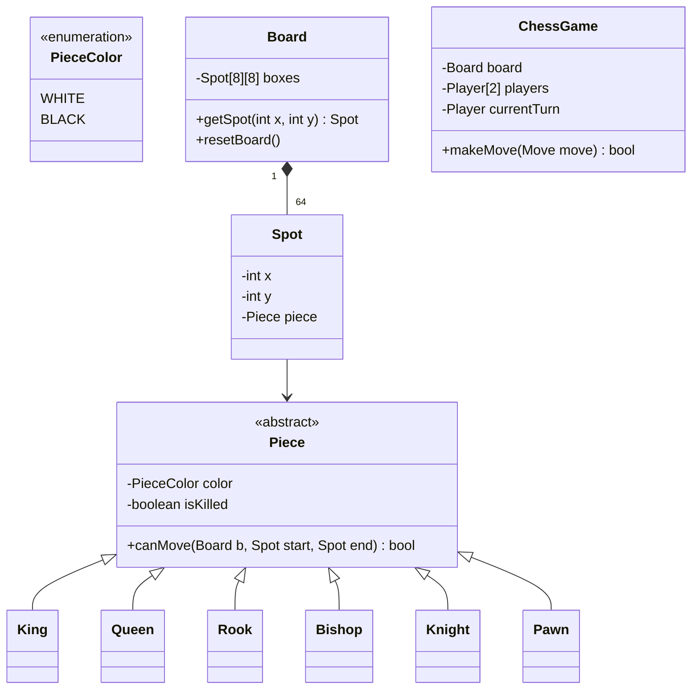

# Worked LLD: Chess Game

A complete Low-Level Design for a standard two-player Chess game modeling boards, pieces, movement validations, turns, and checkmate detection.



---

## 1. Core Classes and Piece Movement (Python)

```python
from enum import Enum
from typing import Optional

class Color(Enum):
    WHITE = 1
    BLACK = 2

class Piece:
    def __init__(self, color: Color):
        self.color = color
        self.is_alive = True

    def can_move(self, board, start, end) -> bool:
        raise NotImplementedError

class Knight(Piece):
    def can_move(self, board, start, end) -> bool:
        # Destination cannot have same color piece
        if end.piece and end.piece.color == self.color:
            return False
        
        dx = abs(start.x - end.x)
        dy = abs(start.y - end.y)
        return (dx * dy) == 2 # 2 and 1 or 1 and 2

class Spot:
    def __init__(self, x: int, y: int, piece: Optional[Piece] = None):
        self.x = x
        self.y = y
        self.piece = piece

class Board:
    def __init__(self):
        self.grid = [[Spot(x, y) for y in range(8)] for x in range(8)]
        self._init_pieces()

    def _init_pieces(self):
        self.grid[0][1].piece = Knight(Color.WHITE)
        self.grid[7][1].piece = Knight(Color.BLACK)

class ChessGame:
    def __init__(self):
        self.board = Board()
        self.turn = Color.WHITE

    def make_move(self, start_x, start_y, end_x, end_y) -> bool:
        start_spot = self.board.grid[start_x][start_y]
        end_spot = self.board.grid[end_x][end_y]
        piece = start_spot.piece

        if not piece or piece.color != self.turn:
            return False

        if not piece.can_move(self.board, start_spot, end_spot):
            return False

        # Execute move
        if end_spot.piece:
            end_spot.piece.is_alive = False

        end_spot.piece = piece
        start_spot.piece = None

        # Toggle turn
        self.turn = Color.BLACK if self.turn == Color.WHITE else Color.WHITE
        return True
```

---

## 2. Key Takeaways

- Encapsulate move validation inside individual Piece subclasses (Polymorphism).
- Represent board coordinates using immutable Spot objects.
- Validate game-level invariants (checks, castling, en-passant) in the coordinating GameController.
