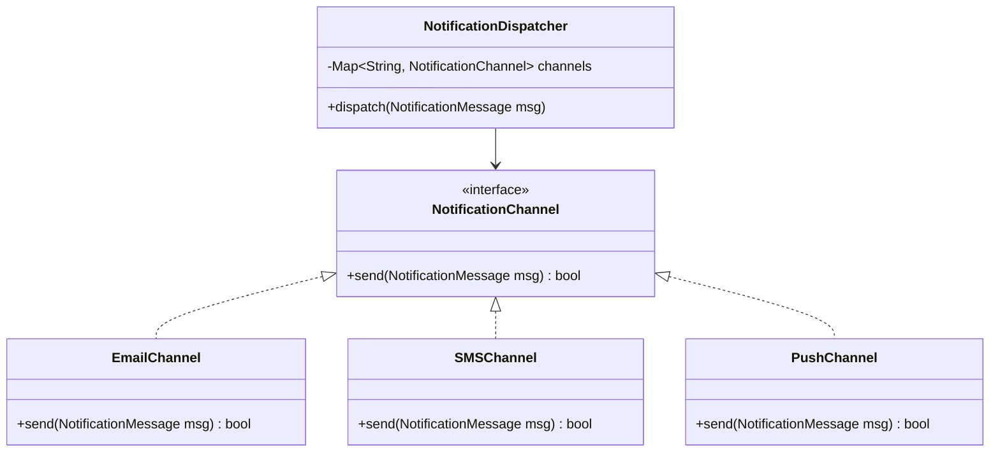

# Worked LLD: Notification Service

A complete Low-Level Design for an extensible, multi-channel notification engine (Email, SMS, Push, Slack) supporting user preference filtering, templates, and rate limiting.



---

## 1. Functional Requirements

1. Support Email, SMS, and Mobile Push channels.
2. Dynamic templating engine.
3. User preferences (e.g., User opt-out of SMS marketing).
4. Extensibility: Add new channels (Slack, WhatsApp) without modifying existing channels (OCP).

---

## 2. Production Code Implementation (Python)

```python
from abc import ABC, abstractmethod
from typing import Dict, List

class NotificationMessage:
    def __init__(self, user_id: str, channel: str, template: str, params: Dict[str, str]):
        self.user_id = user_id
        self.channel = channel
        self.template = template
        self.params = params

class NotificationChannel(ABC):
    @abstractmethod
    def send(self, message: NotificationMessage) -> bool: pass

class EmailChannel(NotificationChannel):
    def send(self, message: NotificationMessage) -> bool:
        print(f"[EMAIL] Sent to {message.user_id}: {message.template}")
        return True

class SMSChannel(NotificationChannel):
    def send(self, message: NotificationMessage) -> bool:
        print(f"[SMS] Sent to {message.user_id}: {message.template}")
        return True

class PushChannel(NotificationChannel):
    def send(self, message: NotificationMessage) -> bool:
        print(f"[PUSH] Sent to {message.user_id}: {message.template}")
        return True

class UserPreferenceService:
    def is_channel_enabled(self, user_id: str, channel: str) -> bool:
        return True # Checked against user settings DB

class NotificationDispatcher:
    def __init__(self):
        self.channels: Dict[str, NotificationChannel] = {}
        self.prefs = UserPreferenceService()

    def register_channel(self, name: str, channel: NotificationChannel):
        self.channels[name] = channel

    def dispatch(self, message: NotificationMessage) -> bool:
        if not self.prefs.is_channel_enabled(message.user_id, message.channel):
            return False # Suppressed by user preferences

        channel = self.channels.get(message.channel)
        if not channel:
            raise ValueError(f"Unsupported channel: {message.channel}")

        return channel.send(message)
```

---

## 3. Key Takeaways

- Apply the Strategy Pattern to make communication channels interchangeable.
- Centralize rate limiting and preference checks before invoking expensive downstream provider APIs (Twilio, SendGrid).
