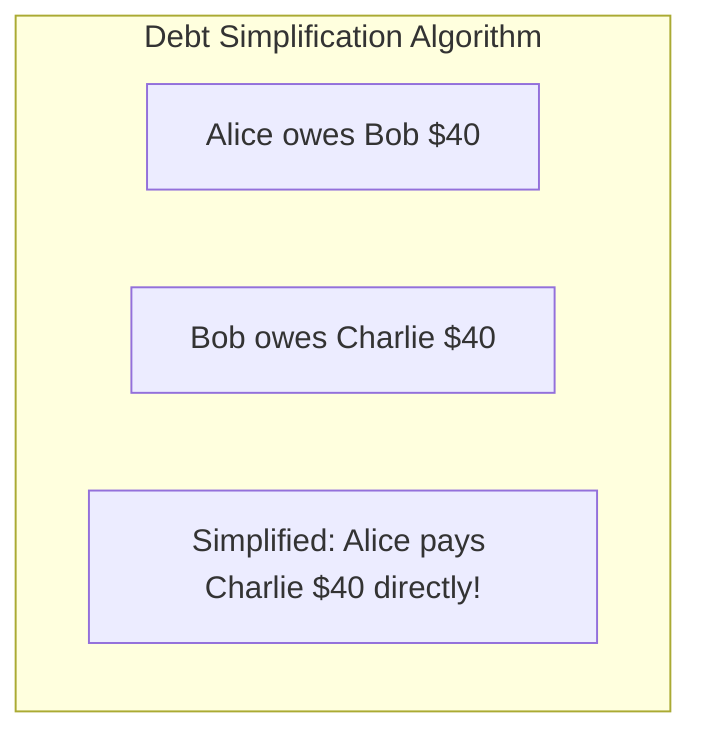

# Worked LLD: Splitwise (Expense Sharing & Debt Simplification)

A complete Low-Level Design for an expense sharing system (Splitwise) supporting Equal, Exact, and Percentage splits, along with the **Greedy Debt Simplification Algorithm**.



---

## 1. Production Code Implementation (Python)

```python
from typing import Dict, List
import heapq

class SplitType:
    EQUAL = "EQUAL"
    EXACT = "EXACT"

class Expense:
    def __init__(self, payer_id: str, amount: float, splits: Dict[str, float]):
        self.payer_id = payer_id
        self.amount = amount
        self.splits = splits # user_id -> amount owed

class DebtSimplifier:
    @staticmethod
    def simplify_debts(balances: Dict[str, float]) -> List[str]:
        # Positive balance = owed money (creditor)
        # Negative balance = owes money (debtor)
        debtors = [] # max heap (stored as positive)
        creditors = [] # max heap

        for user, bal in balances.items():
            if bal < -0.01:
                heapq.heappush(debtors, (bal, user)) # min heap gives most negative
            elif bal > 0.01:
                heapq.heappush(creditors, (-bal, user)) # max heap

        transactions = []
        while debtors and creditors:
            debt_amt, debtor = heapq.heappop(debtors)
            debt_amt = -debt_amt
            cred_amt, creditor = heapq.heappop(creditors)
            cred_amt = -cred_amt

            settled = min(debt_amt, cred_amt)
            transactions.append(f"{debtor} pays {creditor} ${settled:.2f}")

            if debt_amt > cred_amt:
                heapq.heappush(debtors, (-(debt_amt - settled), debtor))
            elif cred_amt > debt_amt:
                heapq.heappush(creditors, (-(cred_amt - settled), creditor))

        return transactions
```

---

## 2. Key Takeaways

- Calculate net balances per user across all transactions ($O(N)$).
- Use two priority heaps (debtors and creditors) to greedily eliminate debt in at most $N-1$ transactions.
