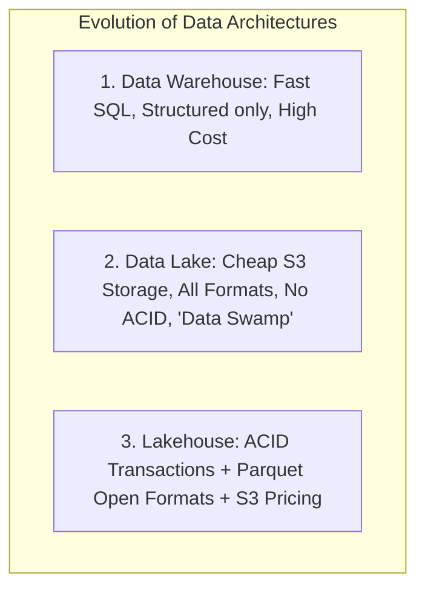

# Data Lakes, Warehouses, and the Lakehouse Architecture

Modern analytical architectures have converged from siloed data warehouses and unstructured data lakes into unified **Lakehouse** platforms (Delta Lake, Apache Iceberg, Apache Hudi).



---

## 1. The Lakehouse Revolution (Apache Iceberg & Delta Lake)

```mermaid
graph TD
    subgraph "Lakehouse Architecture"
        Engines[Query Engines: Spark, Trino, Presto, DuckDB, Snowflake]
        TableFormat[Table Format Layer: Apache Iceberg / Delta Lake<br/>Metadata Files, Snapshots, Manifest Lists]
        FileFormat[Columnar Data Files: Apache Parquet (Zstd)]
        Storage[Cloud Object Storage: AWS S3 / Google Cloud Storage]

        Engines --> TableFormat
        TableFormat --> FileFormat
        FileFormat --> Storage
    end
```

### Superpowers of the Lakehouse:
1. **ACID Transactions on Object Storage**: Serializable snapshot isolation on top of cloud object storage (S3).
2. **Time Travel & Rollbacks**: Query historical snapshots (`SELECT * FROM table TIMESTAMP AS OF '2026-09-01'`).
3. **Partition Evolution**: Modify partition schemes without rewriting billions of underlying Parquet files.
4. **Zero Vendor Lock-in**: Parquet data files on S3 can be queried simultaneously by Snowflake, Trino, Databricks, and Python.

---

## 2. Key Takeaways

- Adopt open table formats (**Apache Iceberg** or Delta Lake) to combine S3 economics with database ACID reliability.
- Use columnar formats (**Apache Parquet**) with Zstd compression for analytical query performance.
- Decouple compute from storage to scale query clusters and storage capacity independently.
