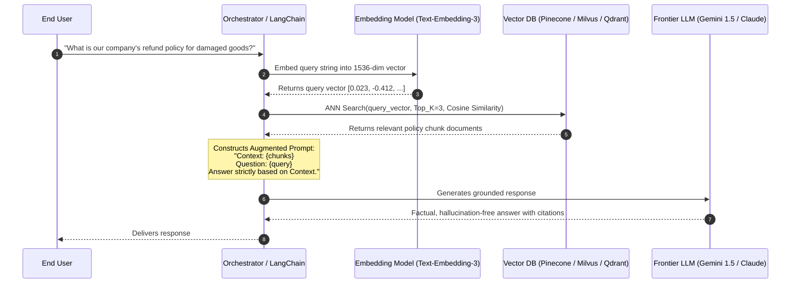
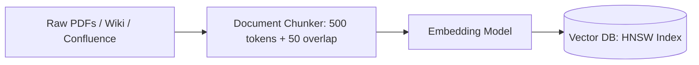

# Retrieval-Augmented Generation (RAG) and Vector Search Systems

Retrieval-Augmented Generation (RAG) grounds Large Language Models (LLMs) with dynamic, proprietary, or private external knowledge, eliminating hallucinations and enabling real-time factual accuracy without expensive fine-tuning.

---

## 1. Document Ingestion Pipeline

### Chunking Strategies:
- **Fixed Size with Overlap**: 500 tokens with 50-token overlap preserves context across boundaries.
- **Semantic / Document Structure**: Chunk by Markdown headers (`#`, `##`) or sentence boundaries.

---

## 2. Advanced RAG Techniques

1. **Hybrid Search (Dense + Sparse)**: Combines dense vector semantic similarity with traditional sparse keyword BM25 search via Reciprocal Rank Fusion (RRF).
2. **Re-Ranking (Cross-Encoder)**: Run top-20 retrieved chunks through a Cohere/BGE cross-encoder model to score relevance before sending the top 5 to the LLM.
3. **Hypothetical Document Embeddings (HyDE)**: The LLM generates a hypothetical answer to the query first; that hypothetical answer is embedded to find real matching documents.

---

## 3. Key Takeaways

- Chunk documents intelligently with semantic boundaries and overlaps.
- Combine vector search with BM25 keyword search (Hybrid Search) to ensure exact keyword and part-number matches.
- Use cross-encoder re-rankers to maximize context relevance while minimizing expensive LLM prompt token costs.
