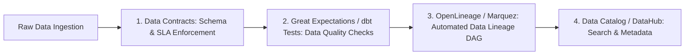

# Data Quality, Lineage, and Governance

Data governance ensures data assets are trustworthy, traceable, compliant with privacy regulations, and accessible across the enterprise.



---

## 1. Data Contracts

A data contract is an explicit agreement between data producers (software engineering teams) and data consumers (data analysts, ML engineers) defining schema, semantic meaning, SLA freshness, and quality guarantees:

```yaml
# Example Data Contract: orders_contract.yaml
dataset: orders
version: 2.1.0
owner: checkout-team
sla:
  freshness_minutes: 15
schema:
  - name: order_id
    type: string
    tests: [unique, not_null]
  - name: total_amount
    type: decimal(10,2)
    tests: [not_null, "total_amount > 0"]
```

---

## 2. Automated Data Lineage (OpenLineage)

When a critical financial dashboard shows incorrect numbers, data lineage tracks the upstream provenance of every row and column back to the originating database tables, Kafka topics, and dbt models.

---

## 3. Key Takeaways

- Implement Data Contracts at the boundary between software services and the data warehouse.
- Automate data quality testing using dbt assertions or Great Expectations.
- Track end-to-end data lineage to rapidly debug data corruption and evaluate upstream change impacts.
