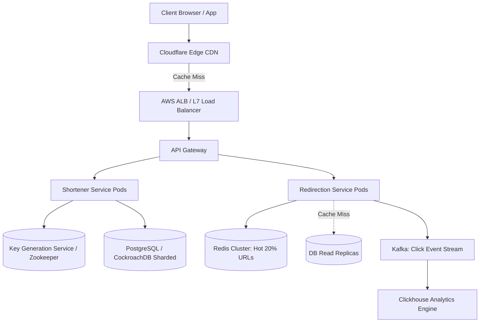

# Design a Production-Grade URL Shortener (Bitly)

A high-scale, globally distributed URL shortening service capable of transforming arbitrary long URLs into compact 7-character aliases, providing sub-10ms HTTP 301/302 redirections and real-time click analytics.



---

## 1. Requirements

### Functional Requirements:
1. Given a long URL, generate a unique, short 7-character alias (e.g., `https://bit.ly/3x8Ab9C`).
2. Redirection: When accessing a short link, redirect user to the original long URL with sub-10ms latency.
3. Custom Aliases: Users can optionally specify a custom alias (e.g., `https://bit.ly/system-design-guide`).
4. Expiration: URLs expire after a user-configured TTL (default 2 years).
5. Analytics: Track click metrics (click count, country, referrer, device, timestamp).

### Non-Functional Requirements:
- **High Availability**: 99.99% uptime. Link redirection must never fail.
- **Ultra-Low Latency**: Redirection p99 $< 15	ext{ms}$.
- **Massive Read-to-Write Ratio**: 100:1 read heavy.
- **Predictable Collision Avoidance**: Zero hash collisions.

---

## 2. Capacity Estimation & Back-of-the-Envelope Math

- **New URLs Created**: 100 Million new URLs per month.
- **Write QPS**: $rac{100,000,000}{30 	imes 86,400} pprox \mathbf{40	ext{ writes/sec}}$ (Peak: $100	ext{ writes/sec}$).
- **Read-to-Write Ratio**: 100:1.
- **Read QPS (Redirections)**: $40 	imes 100 = \mathbf{4,000	ext{ reads/sec}}$ (Peak: $10,000	ext{ reads/sec}$).
- **Storage Sizing (5 Years)**:
  - 100M URLs/month $	imes 12$ months $	imes 5$ years = **6 Billion URLs**.
  - Average record size: 500 bytes (ID: 8B, short_url: 7B, long_url: 400B, user_id: 16B, created_at: 8B).
  - Total Storage = $6	ext{ Billion} 	imes 500	ext{B} pprox \mathbf{3	ext{ Terabytes}}$. (Easily fits on a single NVMe RAID, but sharded for high read IOPS).
- **Cache Sizing (RAM)**:
  - Daily Read Requests = $4,000 	imes 86,400 pprox 350	ext{ Million requests/day}$.
  - Daily Data Volume = $350	ext{M} 	imes 500	ext{B} = 175	ext{ GB/day}$.
  - Pareto Principle (80/20 Rule): Cache 20% of hot URLs = $175	ext{ GB} 	imes 0.20 = \mathbf{35	ext{ GB RAM}}$ (Easily fits on a single 64GB Redis instance).

---

## 3. URL Encoding: Base62 vs MD5 Hashing

To create a 7-character string using characters `[0-9, a-z, A-Z]` ($10 + 26 + 26 = 62	ext{ characters}$):
$$	ext{Total Combinations} = 62^7 pprox \mathbf{3.52	ext{ Trillion unique URLs}}$$
3.52 Trillion URLs is more than 500x our 5-year requirement (6 Billion).

```mermaid
graph LR
    subgraph "Approach 1: MD5 / SHA-256 Hash (Requires Collision Handling)"
        L1[Long URL] --> MD5[MD5 Hash: 128-bit]
        MD5 --> Take7[Take first 7 chars]
        Take7 --> Collide{Collision in DB?}
        Collide -->|Yes: Append Salt & Retry| MD5
        Collide -->|No| Save1[Save Short URL]
    end

    subgraph "Approach 2: Key Generation Service (KGS - Zero Collision)"
        Range[Zookeeper assigns Range 1,000,000 - 2,000,000] --> Node1[KGS Server 1]
        Node1 --> Base62[Convert Auto-Inc ID to Base62: 1000000 -> '4c92']
        Base62 --> Save2[Direct Insert (Guaranteed Unique!)]
    end
```

### The Key Generation Service (KGS) Pattern:
A standalone service pre-generates unique 64-bit sequence numbers. Distributed nodes coordinate via Apache ZooKeeper or etcd. Each KGS worker receives a token range (e.g., Worker 1 gets `1` to `1,000,000`; Worker 2 gets `1,000,001` to `2,000,000`). It converts the counter directly to Base62 without collisions or database round-trips.

---

## 4. API Design

### 1. Create Short URL
```http
POST /api/v1/urls
Content-Type: application/json
Idempotency-Key: 9b1deb4d-3b7d-4bad-9bdd-2b0d7b3dcb6d

{
  "long_url": "https://en.wikipedia.org/wiki/Distributed_computing",
  "custom_alias": "wiki-dist-sys",  // Optional
  "ttl_days": 730
}

HTTP/1.1 201 Created
{
  "short_url": "https://bit.ly/wiki-dist-sys",
  "long_url": "https://en.wikipedia.org/wiki/Distributed_computing",
  "expires_at": "2028-10-01T00:00:00Z"
}
```

### 2. Redirect Short URL
```http
GET /3x8Ab9C HTTP/1.1
Host: bit.ly

HTTP/1.1 301 Moved Permanently
Location: https://en.wikipedia.org/wiki/Distributed_computing
Cache-Control: public, max-age=86400
```
*(Use HTTP 301 for browser caching and lower backend load; use HTTP 302 if strict per-click analytics tracking is required).*

---

## 5. Database Schema (PostgreSQL / CockroachDB)

```sql
CREATE TABLE urls (
    short_code VARCHAR(16) PRIMARY KEY,
    long_url TEXT NOT NULL,
    user_id UUID,
    created_at TIMESTAMP WITH TIME ZONE DEFAULT NOW(),
    expires_at TIMESTAMP WITH TIME ZONE NOT NULL
);

CREATE INDEX idx_urls_expires_at ON urls (expires_at);

-- Clickstream Analytics (Loaded into ClickHouse / Kafka)
CREATE TABLE url_clicks (
    click_id BIGSERIAL PRIMARY KEY,
    short_code VARCHAR(16) NOT NULL,
    clicked_at TIMESTAMP WITH TIME ZONE DEFAULT NOW(),
    country_code VARCHAR(2),
    referrer TEXT,
    user_agent TEXT
);
```

---

## 6. Deep Dive: Handling Hot URL Cache Stampedes

When a viral celebrity tweets a short URL, 100,000 users request the link in a single second. If the cache expires, all 100,000 requests hit the primary database simultaneously (**Cache Stampede**).

```mermaid
sequenceDiagram
    participant C1 as Client 1 (Fast)
    participant C2 as Client 2..10000
    participant Cache as Redis Cache
    participant DB as Postgres DB

    C1->>Cache: GET /3x8Ab9C (Expired!)
    C2->>Cache: GET /3x8Ab9C (Expired!)
    Note over C1: Acquires Redis Distributed Mutex (SETNX lock:3x8Ab9C 1 EX 5)
    C1->>DB: Single query: SELECT long_url FROM urls WHERE short_code='3x8Ab9C'
    Note over C2: Lock acquisition fails; sleeps 50ms & retries cache
    C1->>Cache: SETEX /3x8Ab9C 86400 <long_url>
    C1-->>Cache: Releases Mutex
    C2->>Cache: GET /3x8Ab9C (Cache Hit!)
```

---

## 7. Key Takeaways

- Base62 encoding combined with a distributed Key Generation Service (KGS) completely eliminates hash collision retries.
- 301 redirects maximize edge caching but bypass analytics; 302 redirects allow server-side click tracking.
- Protect against cache stampedes using distributed mutex locks (`SETNX`) or early probabilistic cache warming (XFetch).
