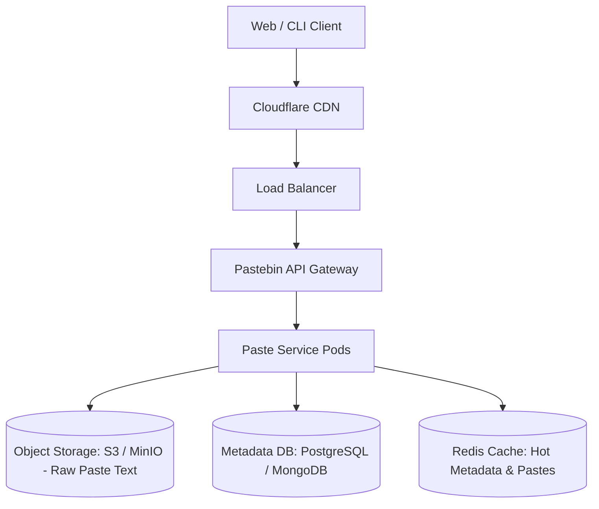

# Design a Scalable Pastebin Service

A text-sharing service (similar to Pastebin or GitHub Gist) that allows users to upload plain text snippets, code, or logs, generating a unique URL for sharing, with optional password protection, syntax highlighting, and automatic TTL expiration.



---

## 1. Requirements

### Functional Requirements:
1. Users can upload a block of text (max 10MB) and receive a unique short URL.
2. Users can view uploaded text via the short URL.
3. Users can set expiration TTL (1 hour, 1 day, 1 week, never).
4. Optional custom slug and password protection.
5. Support raw text output (`/raw/:id`).

### Non-Functional Requirements:
- **Availability**: 99.99%.
- **Read-to-Write Ratio**: 20:1 read-heavy.
- **Latency**: P99 text read latency $< 30	ext{ms}$.
- **Durability**: Pastes with no expiration must never be lost (99.999999999% object storage durability).

---

## 2. Capacity Estimation & Storage Separation

- **Daily New Pastes**: 1 Million pastes/day.
- **Average Paste Size**: 20 KB.
- **Daily Ingress Storage**: $1	ext{M} 	imes 20	ext{ KB} = \mathbf{20	ext{ GB/day}}$.
- **5-Year Storage**: $20	ext{ GB} 	imes 365 	imes 5 pprox \mathbf{36.5	ext{ Terabytes}}$.
- **Write QPS**: $rac{1,000,000}{86,400} pprox \mathbf{12	ext{ pastes/sec}}$.
- **Read QPS (20:1)**: $12 	imes 20 = \mathbf{240	ext{ reads/sec}}$ (Peak: $1,000	ext{ reads/sec}$).

### Architectural Storage Separation:
Storing 20KB text blobs inside relational database rows quickly fragments database pages and bloats B+Tree indexes.
- **Metadata** (ID, author, expiration, hash, size) $	o$ **PostgreSQL / DynamoDB**.
- **Raw Text Payload** $	o$ **AWS S3 Object Storage** (keyed by `paste_id`).

---

## 3. API & Data Model

```http
POST /api/v1/pastes
Content-Type: application/json

{
  "content": "SELECT * FROM users WHERE active = true;",
  "language": "sql",
  "expires_in_seconds": 86400,
  "is_private": false
}

HTTP/1.1 201 Created
{
  "paste_id": "7f8b9a1c",
  "url": "https://paste.example.com/7f8b9a1c",
  "expires_at": "2026-10-02T20:00:00Z"
}
```

```sql
CREATE TABLE paste_metadata (
    paste_id VARCHAR(16) PRIMARY KEY,
    user_id UUID,
    s3_key VARCHAR(255) NOT NULL,
    content_size_bytes INT NOT NULL,
    language VARCHAR(32) DEFAULT 'text',
    password_hash VARCHAR(255),
    created_at TIMESTAMP WITH TIME ZONE DEFAULT NOW(),
    expires_at TIMESTAMP WITH TIME ZONE
);
```

---

## 4. Deep Dive: Automated Expiration & Garbage Collection

Pastes with expired TTLs should not remain in storage forever.

```mermaid
graph TD
    Cron[Scheduled Kubernetes CronJob: Every Hour] --> Query[Query: SELECT paste_id, s3_key FROM paste_metadata WHERE expires_at < NOW() LIMIT 5000]
    Query --> S3Batch[Batch Delete from S3 Bucket]
    S3Batch --> DBDelete[DELETE FROM paste_metadata WHERE paste_id IN (...)]
    
    subgraph Alternative: S3 Native Lifecycle
        S3Object[S3 Object with Tag: 'TTL=7d'] --> S3Engine[S3 Lifecycle Engine Auto-Purges at 0 Cost!]
    end
```

---

## 5. Key Takeaways

- Decouple metadata (relational DB) from bulk text payload (S3 object storage).
- Use Base62 sequence generation for unique, URL-safe 8-character paste identifiers.
- Rely on S3 Lifecycle Policies for zero-compute automated expiration.
