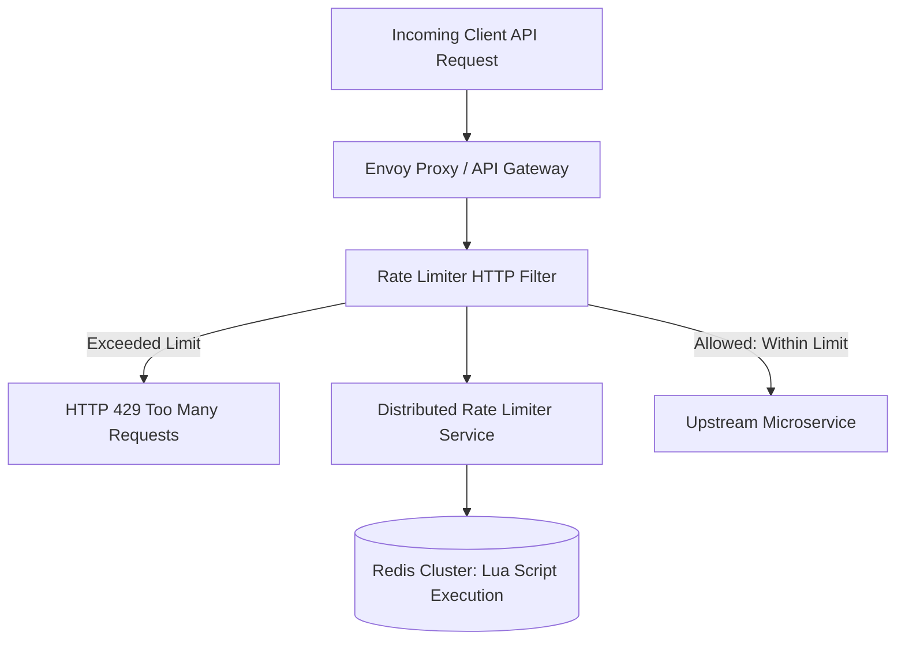

# Design a Distributed Rate Limiting System

A mission-critical distributed rate limiter service that protects public and internal APIs from denial-of-service (DDoS) attacks, brute-force credential stuffing, and resource exhaustion.



---

## 1. Requirements

### Functional Requirements:
1. Limit requests based on client IP, authenticated User ID, or API Key.
2. Support configurable tiered limits (e.g., 100 req/min for free users; 5,000 req/min for enterprise).
3. Return informative HTTP standard headers:
   - `X-RateLimit-Limit: 100`
   - `X-RateLimit-Remaining: 42`
   - `X-RateLimit-Reset: 1696156860`
   - `Retry-After: 30` (on HTTP 429).

### Non-Functional Requirements:
- **Ultra-Low Latency**: Adding rate limiting must not add $> 2	ext{ms}$ overhead to API requests.
- **Distributed Accuracy**: Correct count enforcement across hundreds of distributed gateway pods.
- **Fail-Open Policy**: If the rate limiter crashes, requests must be allowed through (graceful degradation) rather than blocking all legitimate traffic.

---

## 2. Algorithm Comparison: Sliding Window Counter

| Algorithm | Accuracy | Memory Footprint | Burst Handling | Production Verdict |
| :--- | :--- | :--- | :--- | :--- |
| **Token Bucket** | High | Low ($O(1)$ memory) | Allows configured bursts | Excellent for API Gateways |
| **Leaky Bucket** | High | Moderate (Queue depth) | Smooths traffic to constant rate | Great for egress webhooks |
| **Fixed Window** | Low (Boundary spike allows 2x) | Ultra-Low ($O(1)$) | Vulnerable at window boundary | Not recommended |
| **Sliding Window Log**| 100% Exact | Extremely High ($O(N)$ memory) | Precise | Too expensive for high QPS |
| **Sliding Window Counter**| 99% Accurate Approximation | Ultra-Low ($O(1)$) | Smooth and accurate | **Best for high-scale distributed systems** |

---

## 3. Distributed Redis Lua Script (Atomic Execution)

In distributed architectures, running multiple Redis commands (`GET`, increment, `EXPIRE`) from application servers introduces race conditions. We execute the Sliding Window Counter atomically using a single Redis Lua script:

```lua
-- KEYS[1]: Rate limit key (e.g., "ratelimit:user_123:minute")
-- ARGV[1]: Current timestamp (seconds)
-- ARGV[2]: Window size in seconds (e.g., 60)
-- ARGV[3]: Max allowed requests

local key = KEYS[1]
local now = tonumber(ARGV[1])
local window = tonumber(ARGV[2])
local limit = tonumber(ARGV[3])

local clearBefore = now - window
redis.call('ZREMRANGEBYSCORE', key, 0, clearBefore)

local currentRequests = redis.call('ZCARD', key)
if currentRequests < limit then
    redis.call('ZADD', key, now, now)
    redis.call('EXPIRE', key, window)
    return 1 -- Allowed
else
    return 0 -- Denied (Rate limited)
end
```

---

## 4. Key Takeaways

- Execute rate-limiting logic inside Redis via atomic Lua scripts to eliminate distributed race conditions.
- Standardize on `HTTP 429 Too Many Requests` with `Retry-After` headers.
- Always configure a Fail-Open architecture so rate-limiter outages do not bring down the entire company.
