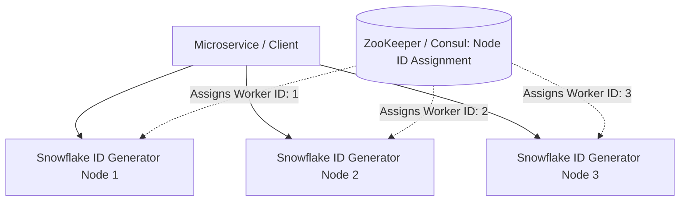

# Design a Distributed Unique ID Generator (Twitter Snowflake)

A high-performance distributed ID generation system capable of creating 64-bit, globally unique, roughly time-sorted integers at a rate of 100,000+ IDs per second with zero central database locks.



---

## 1. Comparing Distributed ID Approaches

| Approach | Length | Sortable? | DB Central Bottleneck? | Production Verdict |
| :--- | :--- | :--- | :--- | :--- |
| **UUIDv4** | 128-bit (String) | No (Completely random) | No | Poor DB indexing performance (B+Tree fragmentation) |
| **MySQL Auto-Increment (Ticket Server)**| 64-bit | Yes | **Yes (Single SPOF / High latency)** | Hard to scale globally |
| **UUIDv7** | 128-bit | Yes (Unix timestamp prefix) | No | Excellent for application-level generation |
| **Twitter Snowflake** | **64-bit (Integer)** | **Yes (Time-ordered)** | **No (In-memory generation)** | **Industry Gold Standard** |

---

## 2. Twitter Snowflake 64-Bit Bit-Allocation Structure

```
+--------------------------------------------------------------------------+
| 1 Bit |    41 Bits Timestamp    | 5 Bits Datacenter | 5 Bits Worker | 12 Bits Sequence |
| Sign  | (Milliseconds since epoch) |        ID         |      ID       |   (Per ms count)   |
+--------------------------------------------------------------------------+
```

### Breakdown of the 64 Bits:
1. **1 Bit (Sign)**: Always `0` to ensure the generated integer is positive.
2. **41 Bits (Timestamp)**: Milliseconds elapsed since a custom epoch (e.g., `2026-01-01T00:00:00Z`).
   - Range: $2^{41} - 1 pprox 2,199,023,255,551	ext{ ms} pprox \mathbf{69.7	ext{ years}}$ of operational lifetime.
3. **5 Bits (Datacenter ID)**: Supports up to $2^5 = 32$ distinct data centers.
4. **5 Bits (Worker Machine ID)**: Supports up to $2^5 = 32$ machines per data center (total 1,024 generator nodes).
5. **12 Bits (Sequence Number)**: Incremented for every ID generated within the exact same millisecond on the same node.
   - Range: $2^{12} = \mathbf{4,096	ext{ unique IDs per millisecond per node}}$ ($pprox 4.096	ext{ Million IDs/sec}$ per node).

---

## 3. Production Code Implementation (Python)

```python
import time
import threading

class SnowflakeIDGenerator:
    def __init__(self, datacenter_id: int, worker_id: int, epoch: int = 1767225600000):
        # 1767225600000 = 2026-01-01 00:00:00 UTC
        self.epoch = epoch
        self.datacenter_id = datacenter_id
        self.worker_id = worker_id
        
        self.sequence = 0
        self.last_timestamp = -1
        self._lock = threading.Lock()

        # Bit allocations
        self.worker_id_bits = 5
        self.datacenter_id_bits = 5
        self.sequence_bits = 12

        self.max_worker_id = -1 ^ (-1 << self.worker_id_bits)
        self.max_datacenter_id = -1 ^ (-1 << self.datacenter_id_bits)
        self.sequence_mask = -1 ^ (-1 << self.sequence_bits)

        self.worker_shift = self.sequence_bits
        self.datacenter_shift = self.sequence_bits + self.worker_id_bits
        self.timestamp_shift = self.sequence_bits + self.worker_id_bits + self.datacenter_id_bits

    def _current_timestamp_ms(self) -> int:
        return int(time.time() * 1000)

    def next_id(self) -> int:
        with self._lock:
            timestamp = self._current_timestamp_ms()

            if timestamp < self.last_timestamp:
                # Clock moved backward (NTP sync anomaly!)
                offset = self.last_timestamp - timestamp
                if offset <= 5: # Small skew: wait it out
                    time.sleep(offset / 1000.0)
                    timestamp = self._current_timestamp_ms()
                else:
                    raise RuntimeError(f"Clock moved backwards by {offset}ms. Refusing to generate ID.")

            if timestamp == self.last_timestamp:
                self.sequence = (self.sequence + 1) & self.sequence_mask
                if self.sequence == 0:
                    # Sequence exhausted for this millisecond: spin-wait until next millisecond
                    while timestamp <= self.last_timestamp:
                        timestamp = self._current_timestamp_ms()
            else:
                self.sequence = 0

            self.last_timestamp = timestamp

            return ((timestamp - self.epoch) << self.timestamp_shift) | \
                   (self.datacenter_id << self.datacenter_shift) | \
                   (self.worker_id << self.worker_shift) | \
                   self.sequence
```

---

## 4. Key Takeaways

- Snowflake generates 64-bit integer IDs that fit natively inside standard database BIGINT columns.
- Natural time-ordering preserves B+Tree database index clustering and eliminates random I/O fragmentation.
- Handle NTP clock backwards drift gracefully by either spin-waiting small deltas or failing fast.
