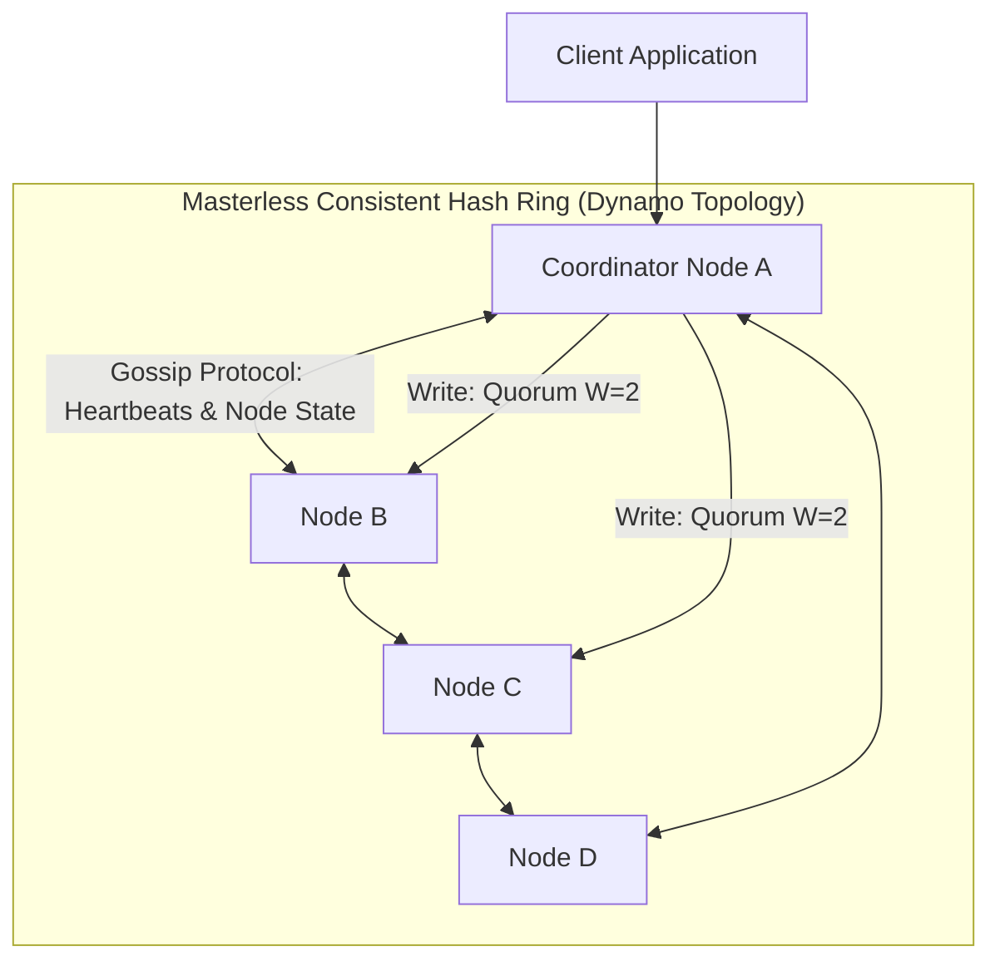

# Design a Distributed Key-Value Store (DynamoDB / Cassandra)

A highly available, horizontally scalable distributed key-value store modeled after Amazon Dynamo and Apache Cassandra, featuring consistent hashing, tunable consistency, and masterless replication.



---

## 1. Requirements

### Functional Requirements:
1. `put(key, value)`: Stores an arbitrary byte payload associated with a key.
2. `get(key)`: Retrieves the value associated with the key.

### Non-Functional Requirements:
- **Massive Scalability**: Scale to millions of writes and reads per second across hundreds of nodes.
- **Tunable Consistency**: Allow callers to select consistency level per request (Strong vs Eventual).
- **High Availability**: No Single Point of Failure (SPOF); survives node crashes and network partitions.

---

## 2. Core Architectural Pillars

```mermaid
graph LR
    P1[1. Consistent Hashing with Virtual Nodes] --> P2[2. Masterless Quorum (N, R, W)]
    P2 --> P3[3. LSM-Tree Storage Engine (SSTable + MemTable)]
    P3 --> P4[4. Gossip Protocol (Failure Detection)]
    P4 --> P5[5. Anti-Entropy with Merkle Trees]
```

### 1. Consistent Hashing with Virtual Nodes
Distributes keys evenly across physical storage nodes. Virtual nodes (e.g., 256 virtual tokens per physical server) eliminate hot spot imbalance and ensure smooth rebalancing when adding/removing nodes.

### 2. Tunable Quorum Consistency ($R + W > N$)
- $N$: Number of replicas storing each key.
- $W$: Number of replicas that must acknowledge a write before returning success.
- $R$: Number of replicas that must respond to a read before returning data.
- **Strong Consistency Formula**:
  $$R + W > N$$
  *(Guarantees that the read set and write set overlap on at least one replica node).*

---

## 3. Storage Engine: LSM-Tree Internals

Each node writes incoming data using an **LSM-Tree** (Log-Structured Merge-Tree) to achieve maximum write throughput:
1. Append to sequential **Write-Ahead Log (WAL)** on disk (crash recovery).
2. Insert into in-memory sorted **MemTable** (Red-Black or SkipList).
3. When MemTable reaches 64MB, flush sequentially to disk as an immutable **SSTable** (Sorted String Table).
4. Accelerate point read misses using an in-memory **Bloom Filter**.

---

## 4. Key Takeaways

- Masterless architectures (Dynamo) eliminate leader election downtime.
- Tune $R$ and $W$ per query to balance latency against strong consistency.
- Use LSM-Trees for ultra-high write throughput, backed by Bloom Filters to optimize read misses.
