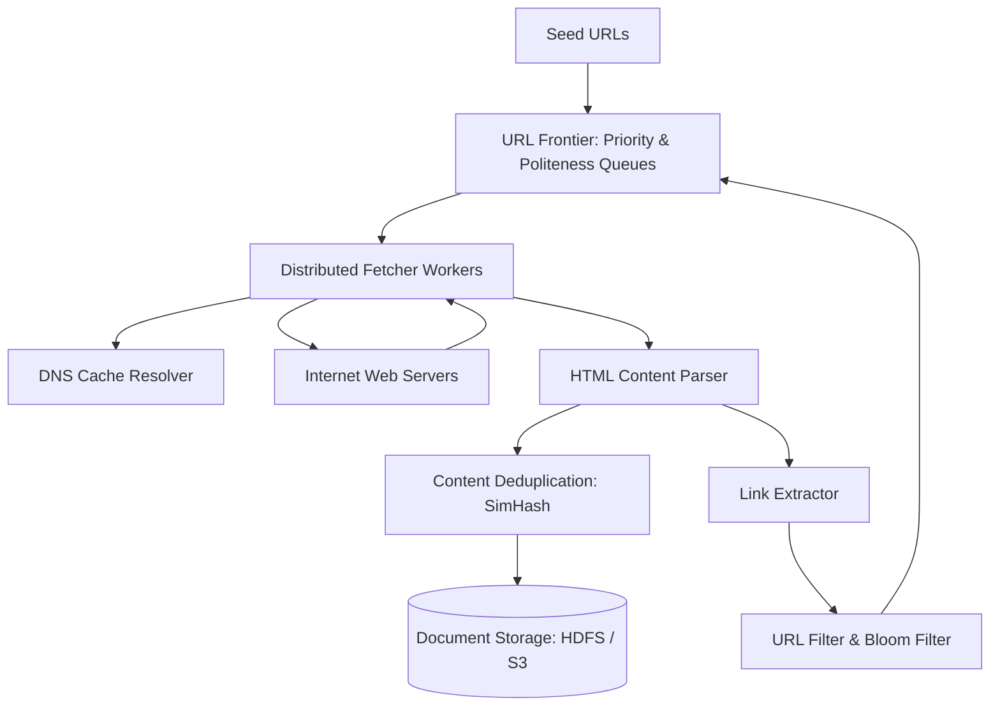

# Design a Distributed Web Crawler (Googlebot)

A petabyte-scale distributed web crawler capable of traversing billions of web pages, extracting links, deduplicating content, and feeding search index pipelines while respecting domain politeness.



---

## 1. Requirements

### Functional Requirements:
1. Crawl 1 Billion web pages every month.
2. Parse HTML, extract hyperlinks, and discover new URLs.
3. Detect and discard duplicate content.
4. Honor `robots.txt` and domain rate limits (**Politeness**).

### Non-Functional Requirements:
- **Scalability**: Capable of ingesting 400+ pages/sec.
- **Politeness**: Never overload target web servers with concurrent requests.
- **Fault Tolerance**: Worker nodes crash without losing frontier state.

---

## 2. The URL Frontier: Balancing Priority and Politeness

The URL Frontier determines *which* URL to fetch next and *when* to fetch it.

```mermaid
graph TD
    subgraph "1. Priority Queues (FIFO / PageRank Scored)"
        In[Incoming URLs] --> Prioritizer[Priority Classifier]
        Prioritizer --> Q_High[High Priority: CNN, Wikipedia]
        Prioritizer --> Q_Low[Low Priority: Personal Blogs]
    end

    subgraph "2. Politeness Queues (Host-Partitioned)"
        Q_High --> HostRouter[Host Router: Hash(domain)]
        Q_Low --> HostRouter
        HostRouter --> HostQ1[Queue: cnn.com]
        HostRouter --> HostQ2[Queue: nytimes.com]
        HostRouter --> HostQN[Queue: wikipedia.org]
    end

    subgraph "3. Politeness Delay Dispatcher"
        HostQ1 --> Delay1[Delay Enforcer: Min 1s gap per host]
        Delay1 --> Worker[Fetcher Thread Pool]
    end
```

---

## 3. Duplicate Detection: SimHash and Bloom Filters

1. **URL Seen Filter**: A distributed **Bloom Filter** holding 5 Billion URLs in ~6 GB of RAM prevents crawling the exact same URL twice.
2. **Near-Duplicate Content Detection (SimHash)**:
   - Web pages with identical text but different banner ads are near-duplicates.
   - **SimHash** maps high-dimensional text to a 64-bit fingerprint. If Hamming distance $\le 3$, documents are considered duplicates and discarded.

---

## 4. Key Takeaways

- Enforce domain politeness using two-tier queues (Priority $	o$ Host Queues with delay timers).
- Use Bloom Filters to prevent circular crawling loops across billions of URLs in memory.
- Use SimHash to detect near-duplicate pages and prevent index pollution.
