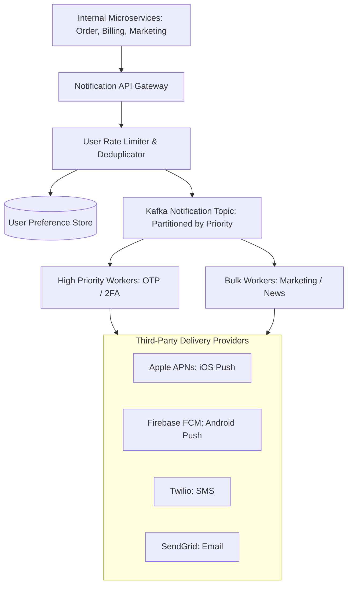

# Design a Scalable Notification System (Apple APNs / Twilio)

A high-throughput, multi-platform notification system capable of delivering 100+ million notifications per day across iOS Push (APNs), Android Push (FCM), SMS (Twilio), and Email (SendGrid).



---

## 1. Requirements

### Functional Requirements:
1. Support 4 notification types: Mobile Push, SMS, Email, In-App.
2. Priority Levels: Critical (OTPs, flight alerts) vs Bulk (promotions).
3. User Preferences: Opt-in / opt-out controls per channel and quiet hours.
4. Delivery status tracking and retry with exponential backoff on failure.

### Non-Functional Requirements:
- **Low Latency**: OTP SMS/Push delivered in $< 3	ext{ seconds}$.
- **Massive Throughput**: Handle 10,000+ notifications per second during breaking news.
- **At-Least-Once Delivery**: No critical notification is lost.

---

## 2. Deduplication and Rate Limiting

To prevent bugged microservices from spamming users with 10 duplicate SMS messages:
1. **Deduplication Hash**:
   $$	ext{DedupKey} = 	ext{SHA256}(	ext{user\_id} + 	ext{channel} + 	ext{message\_digest})$$
   Stored in Redis with a 5-minute TTL:
   ```
   SET dedup:usr_101:sms:hash99 1 NX EX 300
   ```
   If `SET ... NX` returns nil, drop the duplicate notification.
2. **User Rate Limiting**: Max 5 notifications per user per hour (except critical OTPs).

---

## 3. Key Takeaways

- Decouple senders from third-party delivery providers using partitioned message queues (Kafka / RabbitMQ).
- Partition queues by priority so bulk marketing blasts do not block critical 2FA OTP codes.
- Implement Redis deduplication keys to prevent runaway duplicate notifications.
