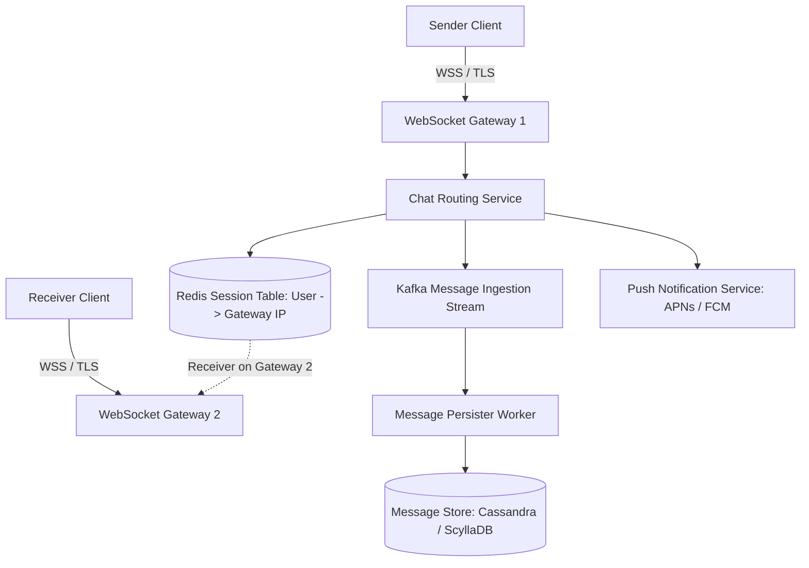
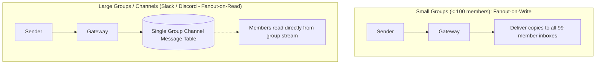

# Design a Real-Time Chat Messaging App (WhatsApp / Slack)

A real-time, end-to-end encrypted messaging service serving 500+ million daily active users, delivering one-on-one chats, group chats, message delivery receipts, and media attachments with sub-100ms latency.



---

## 1. Requirements

### Functional Requirements:
1. One-on-one real-time text chat.
2. Group chats (up to 1,000 members).
3. Online/offline presence and typing indicators.
4. Message status receipts: Sent (1 check), Delivered (2 checks), Read (2 blue checks).
5. Media message sharing (images, videos, documents).

### Non-Functional Requirements:
- **Low Latency**: Message delivery p99 $< 100	ext{ms}$.
- **High Availability**: 99.99% availability.
- **Message Ordering**: Strict per-chat causal message ordering.
- **Offline Support**: Undelivered messages buffered until recipient reconnects.

---

## 2. Capacity Estimation & Back-of-the-Envelope Math

- **Daily Active Users (DAU)**: 500 Million users.
- **Average Messages**: 40 messages per user per day $\implies \mathbf{20	ext{ Billion messages/day}}$.
- **Write QPS**: $rac{20,000,000,000}{86,400} pprox \mathbf{230,000	ext{ messages/sec}}$ (Peak: $500,000	ext{ msg/sec}$).
- **Storage Sizing (5 Years)**:
  - Average text message: 100 bytes (plus metadata: 60 bytes = 160B).
  - Daily Text Storage = $20	ext{B} 	imes 160	ext{B} = \mathbf{3.2	ext{ TB/day}}$.
  - 5-Year Storage = $3.2	ext{ TB} 	imes 365 	imes 5 pprox \mathbf{5.84	ext{ Petabytes}}$.
  - Requires wide-column horizontally partitioned storage (**Apache Cassandra / ScyllaDB**).

---

## 3. Database Schema (Apache Cassandra)

```sql
-- Partitioned by chat_id so all messages in a conversation are on the same node
CREATE TABLE messages (
    chat_id UUID,
    message_id TIMEUUID, -- Snowflake or TimeUUID guarantees chronological ordering
    sender_id UUID,
    content TEXT,
    media_url TEXT,
    status VARCHAR(16), -- 'SENT', 'DELIVERED', 'READ'
    created_at TIMESTAMP,
    PRIMARY KEY (chat_id, message_id)
) WITH CLUSTERING ORDER BY (message_id DESC);
```

---

## 4. Deep Dive: Group Chat Fanout at Scale

In a group chat with 500 members, when 1 person sends a message, should the system duplicate the message 500 times?



---

## 5. Key Takeaways

- Terminate persistent WebSocket connections at dedicated gateway clusters.
- Store messages in Apache Cassandra clustered by `TIMEUUID` for fast sequential pagination.
- Buffer offline messages in distributed queues, falling back to Apple APNs / Firebase FCM push notifications.
