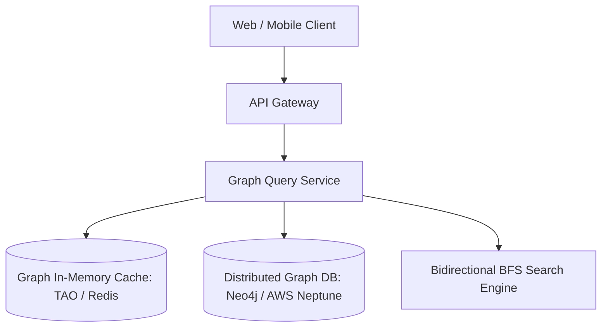
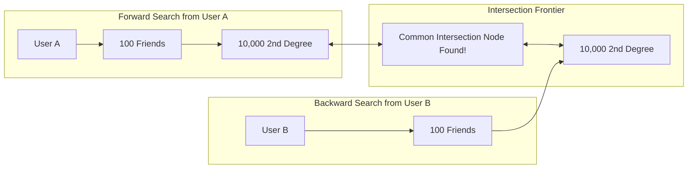

# Design a Social Network Graph (LinkedIn / Facebook Connections)

A graph storage and query system capable of managing 1 Billion users and 100+ Billion connection edges, executing fast $N$-degree separation searches ("People You May Know", mutual friends, company coworker graphs) within 50ms.

---

## 1. Requirements

### Functional Requirements:
1. Add friend / follow relationship (directed or undirected graph edge).
2. Calculate mutual friends between two users.
3. Find shortest connection path (Degrees of Separation: 1st, 2nd, 3rd degree).
4. "People You May Know" (PYMK) recommendation queries.

### Non-Functional Requirements:
- **Low Latency**: 2nd degree query $< 30	ext{ms}$.
- **Scale**: 1 Billion vertices, 100 Billion edges.
- **Eventual Consistency**: Friend graph updates replicate within 1-2 seconds.

---

## 2. Graph Algorithms: Bidirectional BFS for Degrees of Separation

Finding the shortest path between User A and User B:
- **Standard BFS**: Searches outward from User A. If branching factor $B pprox 100$, degree 3 explores $100^3 = \mathbf{1,000,000	ext{ nodes}}$.
- **Bidirectional BFS**: Simultaneously searches forward from User A and backward from User B:
  $$2 	imes 100^{1.5} pprox \mathbf{2,000	ext{ nodes explored}}$$
  *(500x speedup with dramatically lower memory usage!).*

---

## 3. Storage Architecture: Meta's TAO Pattern

Relational databases fail at recursive graph traversal (`JOIN` recursion). Meta developed **TAO**:
- **Objects (Nodes)**: Typed entities (User, Page, Photo).
- **Assocs (Edges)**: Directed, timestamped relations (`(User_A, friend, User_B)`).
- **Two-Tier Cache**: Fast in-memory cache sitting in front of sharded MySQL storage.

---

## 4. Key Takeaways

- Use Bidirectional BFS to find shortest paths between graph nodes in milliseconds.
- Model graph relations as Objects and Associations (TAO model).
- Cache adjacency lists in Redis sets (`SMEMBERS`, `SINTER` for mutual friends).
