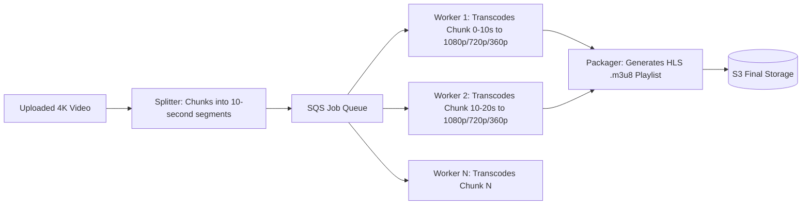

# Design a Global Video Streaming Platform (YouTube / Netflix)

A petabyte-scale video platform supporting user video uploads, asynchronous distributed transcoding into multi-bitrate profiles, global CDN edge caching, and adaptive bitrate streaming (HLS/DASH).

```mermaid
graph TD
    Creator[Content Creator] --> UploadGW[Upload Gateway]
    UploadGW --> RawS3[(Raw Video Bucket: S3)]
    RawS3 --> Kafka[Upload Event Topic]
    
    Kafka --> TranscodeMgr[Transcoding Pipeline Coordinator]
    TranscodeMgr --> WorkerPool[Distributed GPU Transcoder Nodes]
    WorkerPool --> TranscodeS3[(Packaged HLS Chunks S3)]
    
    TranscodeS3 --> CDN[Global CDN: Cloudflare / Fastly]
    CDN --> Viewer[Viewer Video Player (Adaptive Bitrate)]
```

---

## 1. Requirements

### Functional Requirements:
1. Video Upload: Creators can upload high-resolution videos (up to 4K, 50GB).
2. Video Transcoding: Automatically transcode source into multiple resolutions (1080p, 720p, 480p, 360p) in H.264/AV1.
3. Adaptive Bitrate Streaming: Client video player adjusts resolution dynamically based on network bandwidth.
4. Video Metadata & Search: Title, description, tags, view count.

### Non-Functional Requirements:
- **Zero Buffering**: Instant video start time ($< 1	ext{ second}$).
- **Global Scale**: 100+ Million concurrent video streams globally.
- **High Durability**: Uploaded master videos must never be corrupted.

---

## 2. Video Processing Pipeline: Chunk-Based Transcoding

Transcoding a 2-hour 4K video as a single monolithic file on one server takes hours and fails completely if the server crashes at 98%.



---

## 3. CDN Caching Strategy for Video Chunks

Video files are immutable and read-heavy:
- 10-second `.ts` or `.m4s` video segments are aggressively cached at edge CDN locations with `Cache-Control: public, max-age=31536000`.
- 99% of video streaming bandwidth is absorbed by edge CDNs; origin S3 storage serves only the initial cache-fill requests.

---

## 4. Key Takeaways

- Chunk video uploads using S3 Multipart Upload and split videos into 10-second segments for parallel transcoding.
- Package videos using HLS/DASH for client-side Adaptive Bitrate (ABR) streaming.
- Offload 99% of bandwidth delivery to edge CDNs with immutable segment URLs.
