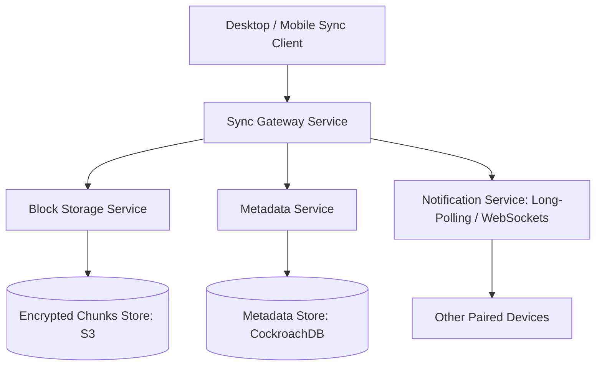

# Design a Cloud File Storage and Sync Service (Dropbox / Google Drive)

A distributed file synchronization and storage service supporting cross-device synchronization, chunk-level deduplication, delta syncing, and offline editing.



---

## 1. Requirements

### Functional Requirements:
1. Users can upload, download, and sync files across desktop and mobile devices.
2. Delta Sync: When a file is modified, upload only changed chunks—not the entire file.
3. Offline Editing: Users can edit files offline; conflicts resolved upon reconnecting.
4. File versioning and rollback history (30-day version recovery).

### Non-Functional Requirements:
- **Efficiency**: Minimize network bandwidth consumption via block-level deduplication.
- **Strong Consistency**: File metadata must reflect the latest state across devices.
- **Data Durability**: 99.999999999% durability for stored files.

---

## 2. Chunking and Delta Synchronization

Files are divided into 4MB chunks (or variable-size chunks using Rabin Fingerprinting):

```mermaid
graph TD
    File[Original File: 16 MB] --> C1[Chunk 1 (4MB): Hash A]
    File --> C2[Chunk 2 (4MB): Hash B]
    File --> C3[Chunk 3 (4MB): Hash C]
    File --> C4[Chunk 4 (4MB): Hash D]

    UserEdits[User edits 1 sentence in Chunk 3] --> NewFile[Modified File]
    NewFile --> NC1[Chunk 1: Hash A - Unchanged]
    NewFile --> NC2[Chunk 2: Hash B - Unchanged]
    NewFile --> NC3[Chunk 3: Hash E - MODIFIED!]
    NewFile --> NC4[Chunk 4: Hash D - Unchanged]

    Note over NC3: Client uploads ONLY Chunk 3 (4MB)! Saves 12MB of bandwidth!
```

---

## 3. Metadata Schema (CockroachDB)

```sql
CREATE TABLE file_metadata (
    file_id UUID PRIMARY KEY,
    user_id UUID NOT NULL,
    path TEXT NOT NULL,
    version INT NOT NULL,
    is_deleted BOOLEAN DEFAULT FALSE,
    updated_at TIMESTAMP WITH TIME ZONE DEFAULT NOW()
);

CREATE TABLE file_blocks (
    file_id UUID,
    block_index INT,
    block_hash VARCHAR(64) NOT NULL, -- SHA-256
    size_bytes INT NOT NULL,
    PRIMARY KEY (file_id, block_index)
);
```

---

## 4. Key Takeaways

- Chunk files into 4MB blocks to support delta sync and client-side deduplication.
- Decouple metadata synchronization (relational CockroachDB) from binary chunk transport (S3).
- Notify paired devices of remote file changes in real time via persistent notification channels.
