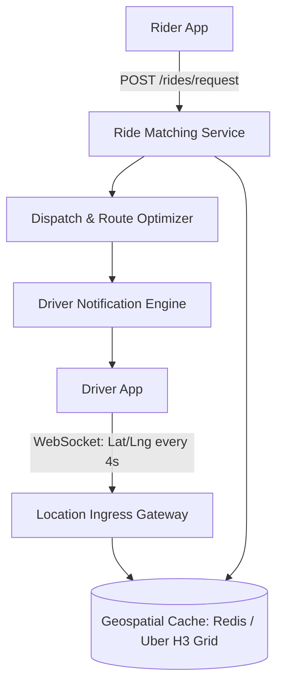

# Design a Ride-Hailing Platform (Uber / Lyft)

A real-time geospatial dispatch and location-tracking system capable of tracking millions of active drivers, matching riders to nearby drivers, dynamic surge pricing, and trip routing.



---

## 1. Requirements

### Functional Requirements:
1. Real-time driver location updates (every 4 seconds).
2. Rider requests ride: Find top $K$ nearest available drivers within 3 km.
3. Driver dispatch: Offer ride to selected driver; handle accept/decline timeout (15s).
4. Dynamic Surge Pricing: Increase fares in high-demand, low-supply geographic hexagons.

### Non-Functional Requirements:
- **Low Latency**: Driver search & matching $< 1	ext{ second}$.
- **Massive Write QPS**: Ingesting location pings from 2 Million active drivers.
- **High Availability**: Service survives regional outages without stranding in-progress trips.

---

## 2. Geospatial Indexing: Uber H3 Hexagonal Grid

- The world is mapped into **H3 Hexagonal Hierarchical Cells** (Resolution 8 $pprox 460	ext{m}$ edge length).
- Every driver's GPS coordinate maps to an `H3Index` (64-bit integer).
- In Redis, active drivers are stored in an in-memory set indexed by Hexagon ID:
  ```
  SADD drivers:hex:882681a339fffff driver_101
  ```
- **Radius Search**: Look up the rider's home hexagon + its 6 immediate neighboring hexagons to find all drivers within seconds!

```mermaid
graph TD
    RiderHex[Rider in Hexagon 0] --> N1[Neighbor Hex 1]
    RiderHex --> N2[Neighbor Hex 2]
    RiderHex --> N3[Neighbor Hex 3]
    RiderHex --> N4[Neighbor Hex 4]
    RiderHex --> N5[Neighbor Hex 5]
    RiderHex --> N6[Neighbor Hex 6]
    Note over RiderHex,N6: All 7 hexagons queried in parallel in Redis in < 2ms!
```

---

## 3. High-Throughput Write Path: Location Buffering

- 2 Million drivers pinging every 4 seconds $\implies \mathbf{500,000	ext{ write QPS}}$.
- Writing 500,000 updates directly to disk databases will destroy I/O throughput.
- **Solution**: Keep live driver locations **strictly in RAM (Redis / Memory)**. Only persist trip start, pickup, and completion events to persistent PostgreSQL storage.

---

## 4. Key Takeaways

- Partition geospatial space using Uber H3 hexagonal cells for uniform neighbor distances.
- Store real-time transient location coordinates purely in in-memory caches (Redis).
- Implement a two-phase dispatch state machine with lease timeouts to prevent race conditions between riders claiming the same driver.
