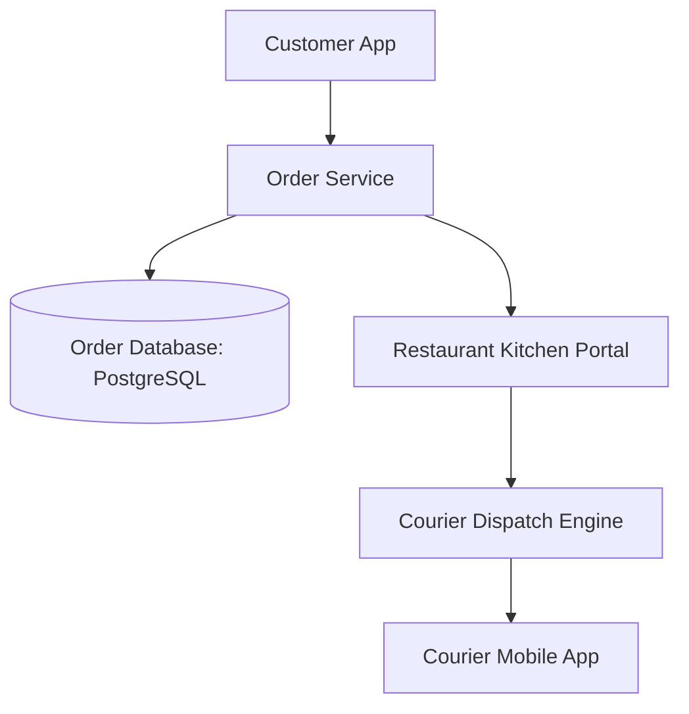
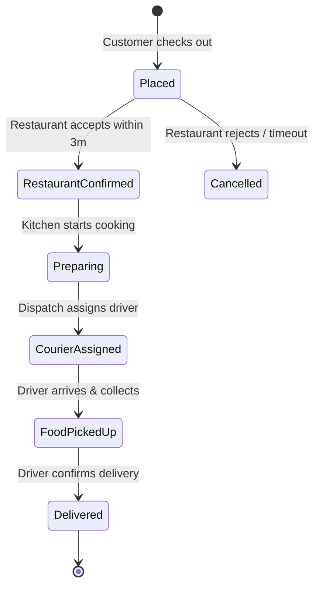

# Design a Food Delivery Platform (DoorDash / UberEats)

A multi-sided marketplace connecting Customers, Restaurants, and Delivery Couriers, coordinating order state transitions, real-time preparation tracking, and courier dispatch.

---

## 1. Requirements

### Functional Requirements:
1. Restaurant menu browsing and cart checkout.
2. Three-sided order lifecycle:
   - Order Placed $	o$ Restaurant Confirms $	o$ Kitchen Preparing $	o$ Courier Dispatched $	o$ Picked Up $	o$ Delivered.
3. Real-time courier GPS tracking for the customer.
4. Estimated Time of Arrival (ETA) calculation.

### Non-Functional Requirements:
- **Consistency**: Zero double-ordering or race conditions on inventory/menu items.
- **Reliability**: Fault-tolerant state machines coordinating multi-actor workflows.
- **Low Latency**: Menu browsing $< 50	ext{ms}$; order placement $< 500	ext{ms}$.

---

## 2. Order State Machine & Orchestration

The order workflow is modeled as a distributed Saga coordinated by Temporal or AWS Step Functions:

---

## 3. Real-Time Courier Tracking with Geofencing

- When the courier is within **100 meters** of the restaurant or customer delivery address, an automated **Geofence Event** triggers:
  - Notifies restaurant: *"Courier has arrived outside!"*
  - Notifies customer: *"Driver is approaching your doorstep!"*

---

## 4. Key Takeaways

- Model complex multi-actor order lifecycles using distributed workflow orchestrators (Temporal / Sagas).
- Decouple static restaurant menus (cached in CDN/Redis) from transactional order placement.
- Use automated geofence triggers to streamline handoffs between restaurants, couriers, and customers.
