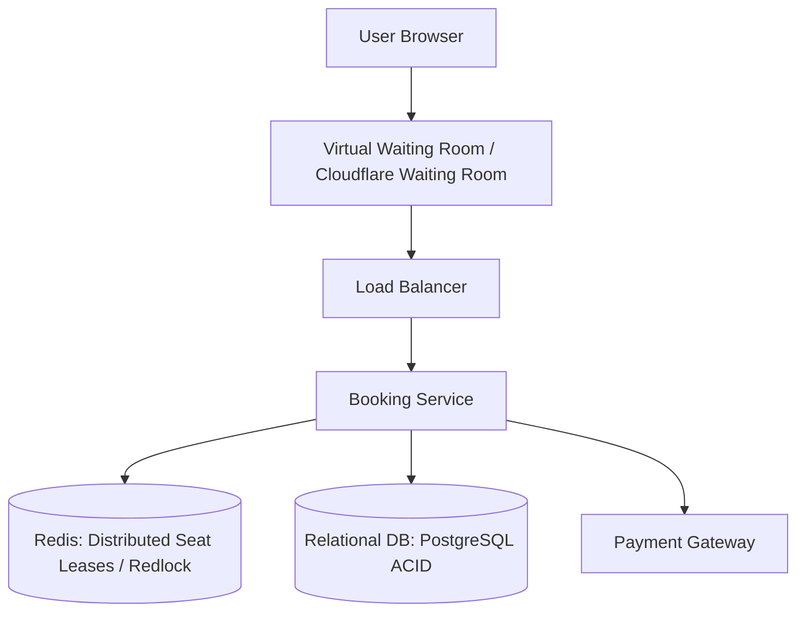
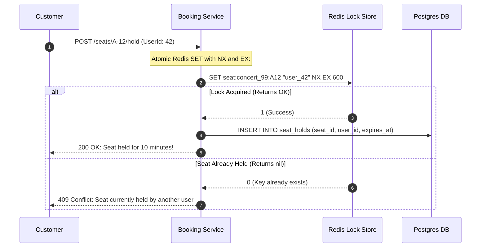

# Design a Ticket and Hotel Booking System (Ticketmaster / Airbnb)

A high-concurrency reservation platform capable of handling extreme flash-sale traffic spikes (Taylor Swift concert sales) without double-booking, ensuring fair allocation and transactional seat locks.



---

## 1. Requirements

### Functional Requirements:
1. Search events / hotels by location, date, and category.
2. View seat map / room availability in real time.
3. Temporary hold / reservation lock: Hold seat for 10 minutes while user enters payment details.
4. Process payment and issue digital ticket.
5. Auto-release seats if 10-minute payment countdown expires.

### Non-Functional Requirements:
- **Strict Consistency**: **ZERO DOUBLE BOOKING**. Two users must never be sold the same seat.
- **Extreme Burst Scalability**: Handle 100,000+ users clicking "Reserve" at the exact same second.
- **Fairness**: Virtual waiting room queuing to prevent bot scalpers.

---

## 2. Preventing Double-Booking: The Distributed Seat Lease Pattern



---

## 3. Database Schema (PostgreSQL with Row Locks)

```sql
CREATE TABLE seats (
    seat_id VARCHAR(32) PRIMARY KEY,
    event_id UUID NOT NULL,
    section VARCHAR(16),
    row_num VARCHAR(8),
    seat_num VARCHAR(8),
    status VARCHAR(16) NOT NULL DEFAULT 'AVAILABLE', -- 'AVAILABLE', 'HELD', 'BOOKED'
    version INT NOT NULL DEFAULT 0 -- Optimistic Concurrency Control
);

-- Finalizing booking with Optimistic Locking:
UPDATE seats 
SET status = 'BOOKED', version = version + 1 
WHERE seat_id = 'A-12' 
  AND status = 'HELD' 
  AND version = :expected_version;
```

---

## 4. Key Takeaways

- Use a Virtual Waiting Room at the edge (Cloudflare) to smooth million-user flash bursts.
- Implement distributed seat leases in Redis using atomic `SET ... NX EX 600` (10-minute hold).
- Enforce strict ACID consistency at the database layer with Optimistic Concurrency Control (`version` column).
