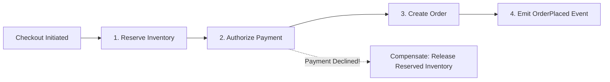

# Design an E-Commerce Platform (Amazon / Shopify)

A distributed commerce platform handling product catalog browsing, search, shopping cart management, inventory reservation, and high-throughput checkout workflows.

```mermaid
graph TD
    Client[Shopper] --> CDN[Edge CDN / Fastly]
    CDN --> GW[API Gateway]

    GW --> CatalogSvc[Product Catalog Service] --> CatalogDB[(Elasticsearch + Postgres)]
    GW --> CartSvc[Shopping Cart Service] --> CartCache[(Redis / DynamoDB)]
    GW --> CheckoutSvc[Checkout Orchestrator (Saga)]
    
    CheckoutSvc --> InvSvc[Inventory Service] --> InvDB[(Inventory DB: Strict ACID)]
    CheckoutSvc --> OrderSvc[Order Service] --> OrderDB[(Order DB)]
    CheckoutSvc --> PaySvc[Payment Service]
```

---

## 1. Requirements

### Functional Requirements:
1. Product catalog browsing and search with filters (brand, price, ratings).
2. Shopping cart persistence across devices.
3. Inventory deduction with atomic check-and-decrement.
4. Order placement, payment processing, and confirmation email.

### Non-Functional Requirements:
- **High Availability**: Catalog browsing must never fail (99.999% uptime).
- **Strong Consistency for Inventory**: Never sell more items than exist in physical stock.
- **Low Latency**: Product page $< 50	ext{ms}$; checkout $< 1	ext{ second}$.

---

## 2. Inventory Reservation: Preventing Overselling

Relational databases guarantee ACID atomicity during checkout:

```sql
-- Atomic check and decrement in a single SQL statement:
UPDATE inventory
SET available_quantity = available_quantity - :purchased_quantity,
    version = version + 1
WHERE product_id = :product_id 
  AND available_quantity >= :purchased_quantity;
```
If the rows affected is `1`, the inventory was successfully reserved without table-level locking. If rows affected is `0`, stock was exhausted.

---

## 3. The Checkout Saga Pattern



---

## 4. Key Takeaways

- Decouple read-heavy catalog browsing (Elasticsearch + CDN) from write-critical inventory deduction.
- Use atomic SQL `UPDATE ... WHERE available_quantity >= :qty` to eliminate overselling race conditions.
- Coordinate multi-service checkout workflows using Sagas with automated compensating transactions.
