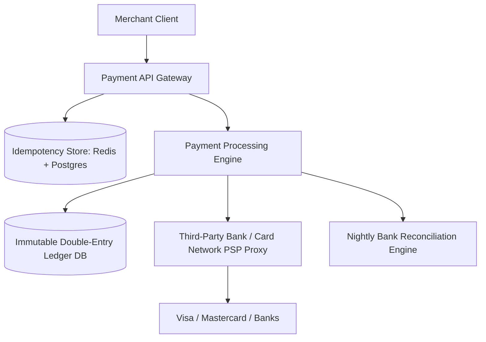
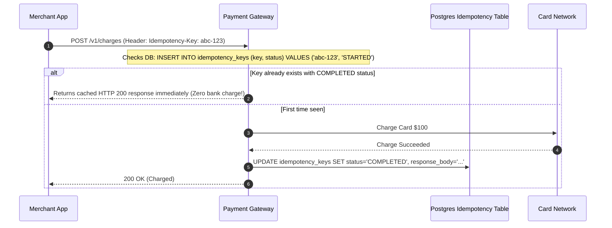

# Design a Global Payment Processing System (Stripe / PayPal)

A mission-critical financial ledger and payment processing gateway requiring zero data loss, exact idempotency, ledger double-entry bookkeeping, and bank reconciliation.



---

## 1. Requirements

### Functional Requirements:
1. Charge credit cards and bank accounts.
2. Provide absolute idempotency: duplicate requests must never result in duplicate charges.
3. Maintain an immutable double-entry accounting ledger.
4. Nightly reconciliation against bank settlement settlement files.

### Non-Functional Requirements:
- **Zero Data Loss**: Highest durability and auditability standards (PCI-DSS Level 1 compliant).
- **Strict Idempotency**: Safe automatic client retries.
- **High Availability**: 99.999% uptime.

---

## 2. Double-Entry Bookkeeping Principles

In financial accounting, money never magically appears or vanishes; it moves between accounts. Every transaction must have **at least two entries** where:
$$\sum 	ext{Debits} = \sum 	ext{Credits}$$

```mermaid
graph LR
    subgraph "Customer Buys $100 Product (Double-Entry Ledger)"
        D1[Debit: Customer Cash Account +$100]
        C1[Credit: Merchant Payable Account +$97]
        C2[Credit: Stripe Fee Revenue Account +$3]
    end
    Note over D1,C2: Total Debits ($100) == Total Credits ($97 + $3 = $100)! Balanced!
```

---

## 3. Strict Idempotency Implementation



---

## 4. Key Takeaways

- Financial systems must enforce Double-Entry Bookkeeping where debits equal credits.
- All payment APIs must enforce unique client-supplied `Idempotency-Key` headers.
- Implement automated nightly reconciliation to detect discrepancies between internal ledgers and bank clearing files.
