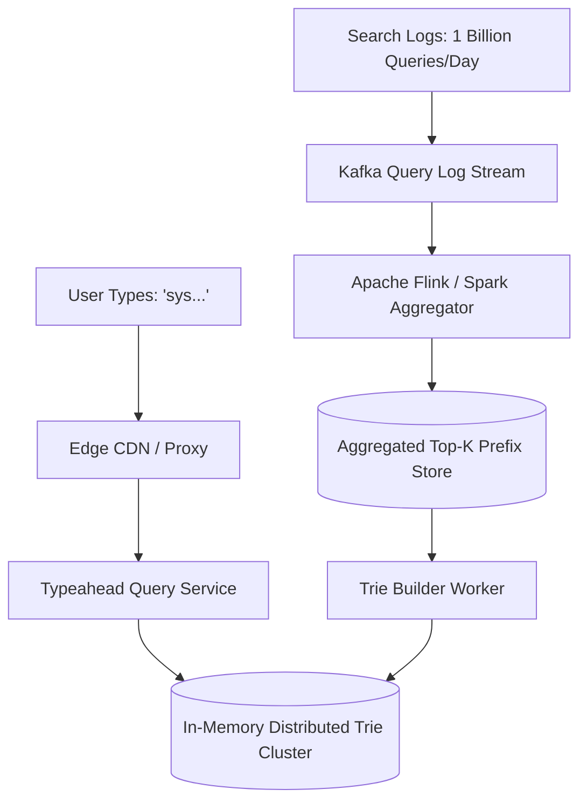
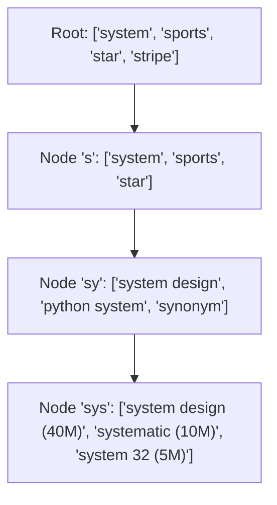

# Design a Real-Time Search Autocomplete / Typeahead (Google Search)

A low-latency search typeahead system capable of returning top 5 query suggestions within 30ms as a user types each keystroke into a search bar.

---

## 1. Requirements

### Functional Requirements:
1. As the user types, suggest the top 5 most popular completions matching the prefix.
2. Update prefix rankings based on recent real-world query frequency.
3. Spell check and typo tolerance for minor spelling mistakes.

### Non-Functional Requirements:
- **Ultra-Low Latency**: Suggestions returned within $< 30	ext{ms}$ per keystroke.
- **High Throughput**: 100,000+ keystroke queries per second.
- **High Availability**: 99.99%.

---

## 2. Data Structure: Trie with Precomputed Top-K Nodes

A standard Trie requires traversing all child branches to find top completions, resulting in slow $O(M)$ searches during query time.

### The Precomputed Trie Optimization:
Store the precomputed top 5 search terms directly inside **every parent Trie node**:

Now, querying the prefix `"sys"` takes **$O(L)$ time** where $L$ is the length of the prefix (3 operations), immediately returning the top 5 array in **0.01ms**!

---

## 3. Trie Partitioning across Shards

A complete global Trie of 100 Million prefixes consumes $pprox 50	ext{GB}$ of memory.
- **Partitioning Strategy**: Consistent hashing on the **first 2 letters** of the prefix (`"aa" - "az"`, `"ba" - "bz"`).
- Hot prefixes (e.g., `"g"`, `"s"`) are replicated across multiple read-only server clusters.

---

## 4. Key Takeaways

- Store precomputed Top-K suggestions directly inside each Trie node for $O(L)$ prefix lookup.
- Aggregate search frequency asynchronously using stream processing (Kafka + Flink).
- Cache popular prefix responses at edge CDNs and in browser localStorage.
