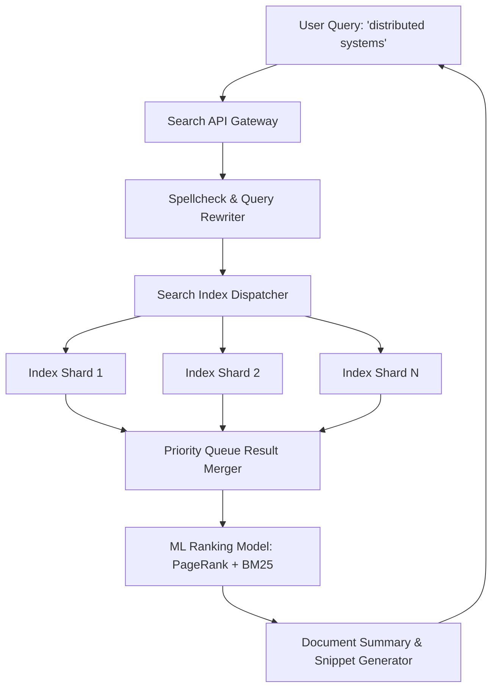

# Design a Large-Scale Web Search Engine (Google Search)

A petabyte-scale search engine architecture handling the full lifecycle of internet search: distributed crawling, index building, inverted indexing, and multi-stage ranking (PageRank + BM25 + Deep Learning).



---

## 1. Requirements

### Functional Requirements:
1. Search billions of web pages by keyword queries.
2. Return ranked list of 10 most relevant documents with titles, URLs, and snippet summaries.
3. Query suggestions and spelling correction.

### Non-Functional Requirements:
- **Ultra-Fast Latency**: p99 search query latency $< 200	ext{ms}$.
- **Massive Scale**: Index tens of billions of web pages.
- **Relevance**: High precision and recall.

---

## 2. Inverted Index Partitioning: Term Partitioning vs Document Partitioning

```mermaid
graph TD
    subgraph "1. Term Partitioning (By Word)"
        NodeA["Node A holds all docs for words: 'apple' -> 'cat'"]
        NodeB["Node B holds all docs for words: 'dog' -> 'zebra'"]
        Note over NodeA: Single multi-word query must scatter-gather across nodes!
    end

    subgraph "2. Document Partitioning (By Doc ID - Standard Practice)"
        Node1["Node 1 holds words for Doc 1 to 10,000,000"]
        Node2["Node 2 holds words for Doc 10,000,001 to 20,000,000"]
        Note over Node1,Node2: Every node evaluates full query independently over local subset!
    end
```

Modern search engines use **Document Partitioning**: every shard evaluates the full multi-word query against its local subset of documents, minimizing cross-node network dependencies.

---

## 3. The PageRank Algorithm

Web pages are ranked not just by keyword density, but by authority measured by incoming links:
$$PR(u) = rac{1-d}{N} + d \sum_{v \in B_u} rac{PR(v)}{L(v)}$$
- $B_u$: Set of pages linking to page $u$.
- $L(v)$: Number of outbound links on page $v$.
- $d$: Damping factor (typically 0.85).

---

## 4. Key Takeaways

- Use Document Partitioning to build horizontally scalable inverted index clusters.
- Precompute PageRank and static quality scores offline.
- Execute two-stage ranking: fast inverted index candidate retrieval followed by deep neural ranking models.
