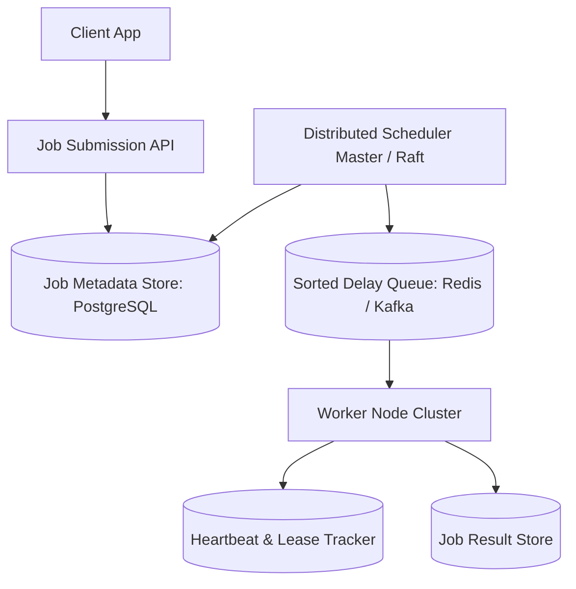
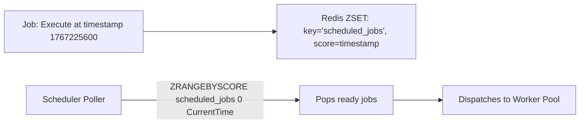

# Design a Distributed Job Scheduler (Cron / Celery / Airflow)

A resilient, horizontally scalable distributed task scheduling platform capable of executing millions of scheduled (cron) and ad-hoc background jobs with exact timing guarantees and fault tolerance.

---

## 1. Requirements

### Functional Requirements:
1. Schedule one-off delayed tasks (e.g., "Send email in 30 minutes").
2. Schedule recurring cron jobs (`0 0 * * *` = daily midnight).
3. Task dependency Directed Acyclic Graphs (DAGs) (Job B runs only after Job A succeeds).
4. Automatic retries with exponential backoff on worker crash.

### Non-Functional Requirements:
- **Fault Tolerance**: If a worker node crashes mid-execution, reassign the job to another worker.
- **At-Least-Once Execution**: No scheduled job is permanently dropped.
- **Scale**: Execute 10+ Million jobs per day.

---

## 2. Scheduling Delay Queue: Redis Sorted Sets vs Hierarchical Timing Wheels

To schedule jobs with future execution timestamps:

### Hierarchical Timing Wheels:
For ultra-high-throughput sub-second scheduling, **Hierarchical Timing Wheels** (used by Kafka and Netty) execute timer registrations in $O(1)$ time without sorted list insertion overhead ($O(\log N)$).

---

## 3. Worker Heartbeating and Failure Recovery

Workers hold a lease on running jobs:
1. Worker acquires task: `UPDATE jobs SET status='RUNNING', heartbeat=NOW() WHERE id=:id`.
2. Worker sends a heartbeat ping every 10 seconds.
3. If heartbeat is missing for 60 seconds, Scheduler marks the job `FAILED` and re-queues it for another worker.

---

## 4. Key Takeaways

- Use Redis Sorted Sets or Timing Wheels for high-performance delayed job queues.
- Prevent duplicate execution using database row-level locking or distributed fencing tokens.
- Implement worker heartbeats with timeout leases to recover from worker hardware crashes.
