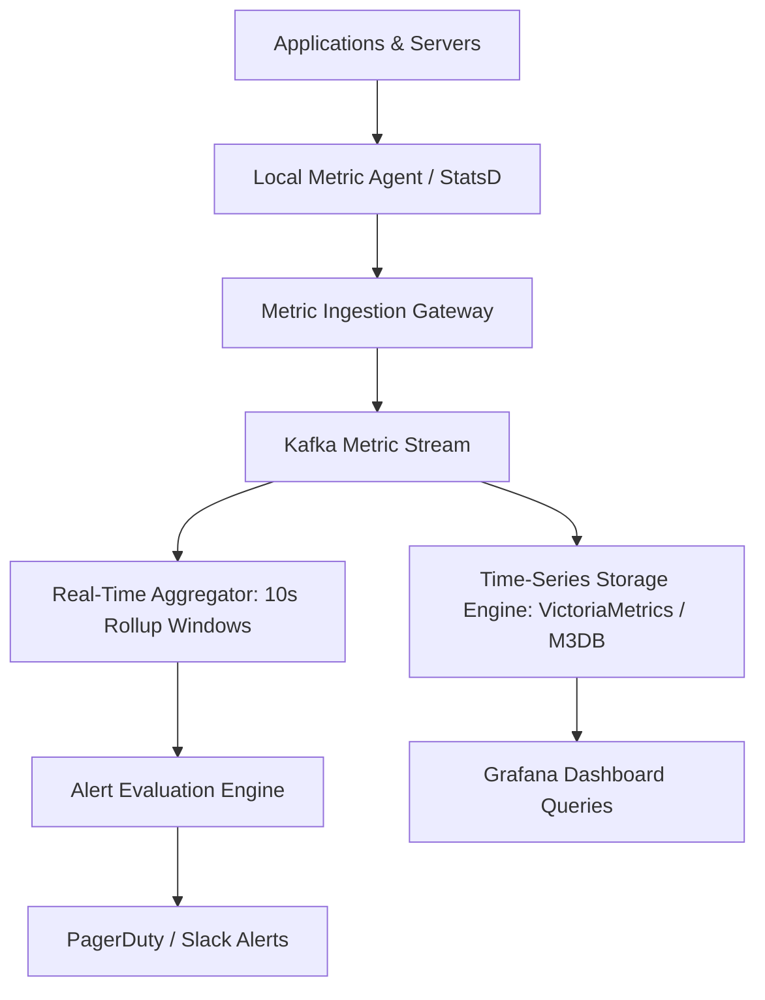
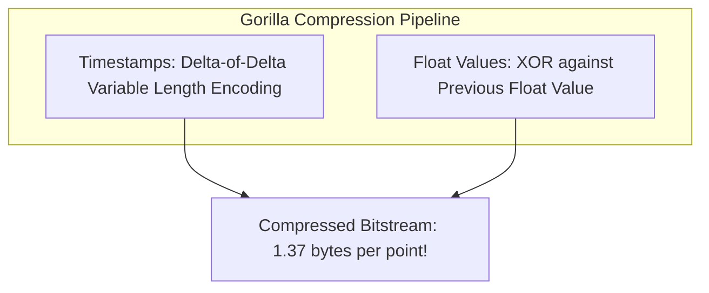

# Design a Distributed Metrics and Monitoring System (Datadog / Prometheus)

A massive-scale time-series metric collection, aggregation, and alerting pipeline capable of ingesting billions of metric data points per day and answering analytical aggregation queries in seconds.

---

## 1. Requirements

### Functional Requirements:
1. Ingest metric data points: `(metric_name, tags, timestamp, value)`.
2. Support high-cardinality tagging (`service=order`, `region=us-east`, `host=i-1234`).
3. Query aggregations: `sum(rate(http_requests[5m])) by (service)`.
4. Configurable threshold alerting rules.

### Non-Functional Requirements:
- **High Ingestion Throughput**: Ingest 10 Million metric points per second.
- **Query Performance**: Sub-second queries for dashboard graphs.
- **Storage Efficiency**: Aggressive compression (Gorilla compression: $< 2$ bytes per sample).

---

## 2. Gorilla Time-Series Compression Algorithm (Facebook)

Standard metric points require 16 bytes (8B timestamp + 8B float value). Facebook's **Gorilla** algorithm compresses this to an average of **1.37 bytes per data point**:

### 1. Timestamp Delta-of-Delta:
If metrics report every 60 seconds, the delta is 60. The delta-of-delta is $60 - 60 = 0$. A delta-of-delta of `0` is encoded as a **single bit `0`**!

### 2. Float XOR:
Successive float values share significant leading and trailing zeros. Storing only the XOR delta eliminates redundant bits.

---

## 3. Rollup and Downsampling Pipelines

Raw 1-second metrics are aggressively downsampled:
- **Raw (1s resolution)**: Retained for 7 days.
- **Rollup (1m resolution)**: Retained for 30 days.
- **Rollup (1h resolution)**: Retained for 1 year.

---

## 4. Key Takeaways

- Use Gorilla time-series compression (Delta-of-Delta + XOR) to reduce metric storage by 10x.
- Decouple metric ingestion via Kafka to absorb sudden traffic bursts.
- Downsample metrics into 1-minute and 1-hour rollup tiers to provide fast year-long queries.
