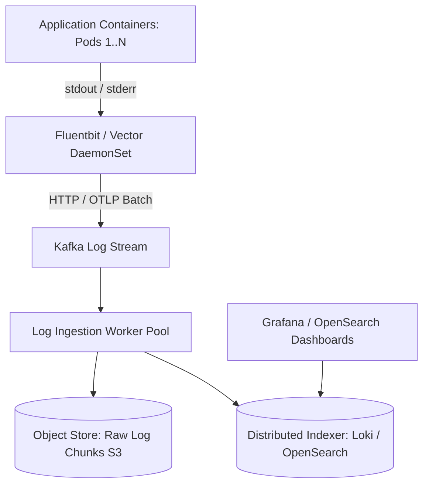

# Design a Distributed Log Aggregation System (ELK / Loki)

A high-throughput distributed log collection, indexing, and search architecture capable of ingesting tens of terabytes of log data daily across thousands of microservice containers with near real-time searchability.

---

## 1. Requirements

### Functional Requirements:
1. Ingest logs from thousands of distributed application servers.
2. Support structured JSON and unstructured text parsing.
3. Full-text search with regex and label filtering (`app=order AND level=ERROR`).
4. Automated retention and lifecycle tiering (purge after 30 days).

### Non-Functional Requirements:
- **Zero Loss of Critical Logs**: Buffered against network partitions.
- **Cost Efficiency**: Minimize indexing storage overhead (Grafana Loki approach).
- **Search Latency**: Sub-second search for recent 1-hour logs.

---

## 2. OpenSearch vs Grafana Loki: The Indexing Trade-off

| Dimension | OpenSearch / Elasticsearch | Grafana Loki |
| :--- | :--- | :--- |
| **Indexing Strategy** | Full-text Inverted Index on every word | **Indexes metadata labels ONLY**; greps compressed chunks |
| **Index Size** | 100% - 150% of raw data size | **< 5% of raw data size** |
| **Storage Backend** | Costly local NVMe disks | Direct cheap **AWS S3 Object Storage** |
| **Ingestion Speed** | Moderate (heavy CPU for indexing) | Blazing fast (just writes compressed chunks) |
| **Best For** | Ad-hoc text search across billions of docs | High-volume Kubernetes container logs |

---

## 3. Key Takeaways

- Use lightweight agents (Vector / Fluentbit) as DaemonSets on every Kubernetes node.
- Buffer incoming log streams via Kafka to prevent log drops during traffic surges.
- Choose Loki's label-only indexing pattern to cut log storage infrastructure costs by 80%.
