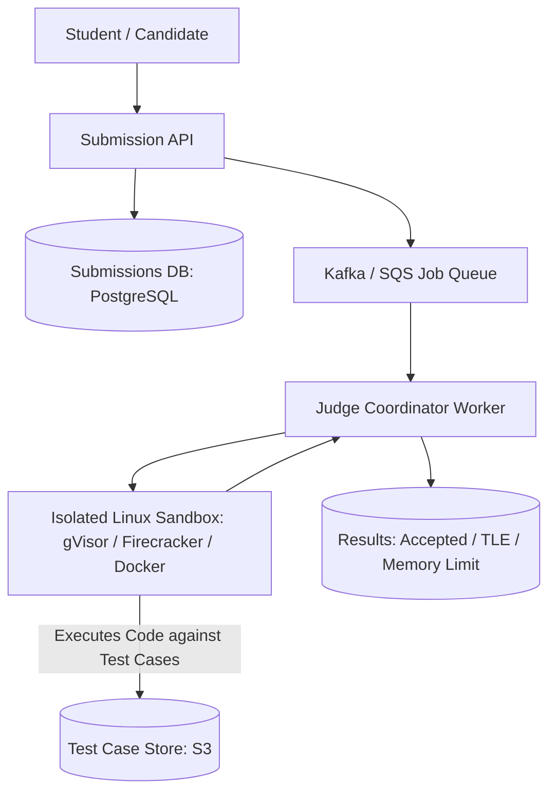

# Design an Online Code Judge (LeetCode / HackerRank)

A secure, isolated code execution and grading engine capable of compiling, running, and benchmarking arbitrary untrusted user code (Python, C++, Java, Rust) against hidden test suites with strict CPU, memory, and security sandboxing.



---

## 1. Requirements

### Functional Requirements:
1. Submit code in multiple languages (Python, Java, C++, Go).
2. Execute code against hidden test cases.
3. Return grading status: Accepted (AC), Wrong Answer (WA), Time Limit Exceeded (TLE), Memory Limit Exceeded (MLE), Runtime Error (RE).
4. Measure exact execution runtime and memory usage.

### Non-Functional Requirements:
- **Security**: **Untrusted user code must NEVER escape the sandbox or access internal cloud networks**.
- **Fairness & Determinism**: Consistent execution timing across runs.
- **High Throughput**: Handle 1,000 concurrent submissions during coding competitions.

---

## 2. Sandboxing Architecture: Preventing Remote Code Execution (RCE)

Running arbitrary user code (`os.system("rm -rf /")` or `curl 169.254.169.254`) on a host VM is dangerous.

```mermaid
graph LR
    UserCode[Untrusted User Code] --> Cgroups[Linux Cgroups: Hard CPU & RAM Limits]
    Cgroups --> Seccomp[Seccomp: Blocks Network & Fork Syscalls]
    Seccomp --> MicroVM[gVisor / Firecracker MicroVM: User-Space Kernel Isolation]
    MicroVM --> HostOS[Host Linux OS (Protected!)]
```

### Security Layers:
1. **Linux Cgroups v2**: Enforces strict memory caps (e.g., 256MB) and CPU quotas (e.g., 1 CPU core).
2. **Seccomp Filters**: Whitelists only safe syscalls (`read`, `write`, `exit`). **Blocks network sockets (`socket`, `connect`) and process forks (`fork`, `clone`) to prevent fork bombs**.
3. **gVisor (Google)**: Intercepts all syscalls in a user-space sandbox, protecting the host Linux kernel from kernel privilege escalation exploits.

---

## 3. Key Takeaways

- Execute untrusted code inside multi-layered sandboxes (cgroups + seccomp + gVisor/Firecracker).
- Block all network access at the kernel socket layer to prevent SSRF and external attacks.
- Decouple code submission from grading execution using asynchronous message queues.
