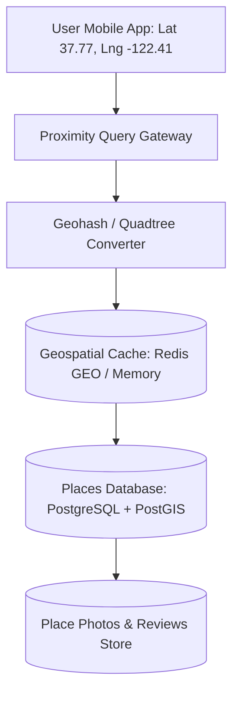
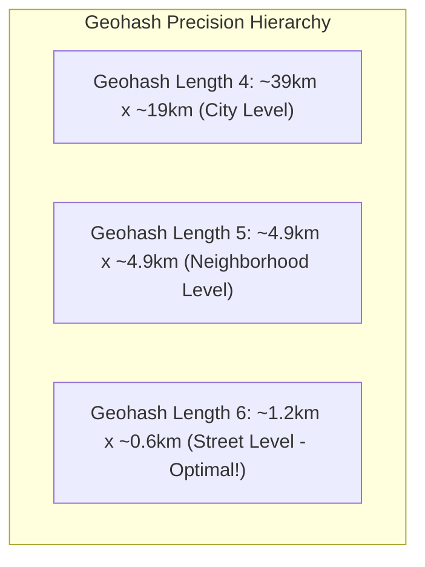

# Design a Proximity Service (Yelp / Google Places Nearby)

A location-based search service capable of finding nearby points of interest (restaurants, gas stations, ATMs) within a specified radius (e.g., "Find all Italian restaurants within 2 km of my location") with sub-50ms latency.



---

## 1. Requirements

### Functional Requirements:
1. Add, update, and delete places of interest (restaurants, bars, stores).
2. Given a latitude, longitude, and radius, return all matching places within the radius.
3. Filter by category, price, and customer rating.

### Non-Functional Requirements:
- **Low Latency**: Nearby search $< 50	ext{ms}$.
- **High Read Scale**: 100:1 read-to-write ratio (places rarely move; users constantly search).
- **High Availability**: 99.99%.

---

## 2. Geospatial Indexing: Geohashes vs PostGIS



### Radius Query Mechanics:
1. Convert user's latitude/longitude to a **6-character Geohash** (e.g., `9q8yyk`).
2. Calculate the **8 surrounding neighboring geohash cells** to eliminate boundary miss edge cases.
3. Query database or Redis using fast prefix matching:
   ```sql
   SELECT place_id, name, lat, lng 
   FROM places 
   WHERE geohash_prefix IN ('9q8yyk', '9q8yym', ...);
   ```
4. Filter matching candidates in memory using the Haversine distance formula.

---

## 3. Key Takeaways

- Geohash prefix matching reduces 2D geospatial searches to simple 1D database index range scans.
- Always query the target cell plus its 8 immediate neighboring cells to avoid edge boundary misses.
- Cache neighborhood query results at edge CDNs and in Redis to absorb 95% of read traffic.
