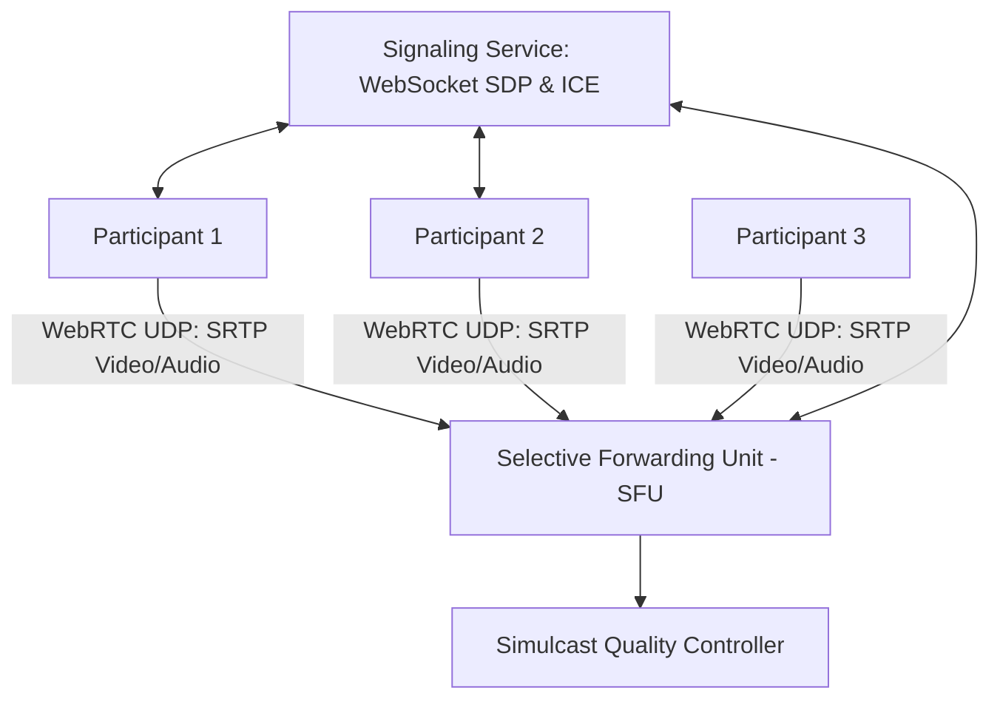

# Design a Real-Time Video Conferencing Platform (Zoom / Google Meet)

A low-latency, multi-party video conferencing architecture supporting 1,000+ participants per call, screen sharing, audio/video mixing, and adaptive bitrate encoding with sub-200ms glass-to-glass latency.



---

## 1. Requirements

### Functional Requirements:
1. Multi-party real-time audio and video calls (up to 1,000 participants).
2. Screen sharing and real-time text chat.
3. Call recording and cloud storage.

### Non-Functional Requirements:
- **Ultra-Low Latency**: End-to-end glass-to-glass latency $< 150	ext{ms}$.
- **Adaptive Quality**: Smooth video playback across unstable cellular connections.
- **Resilience**: Handle 15% network packet loss without audio breakup.

---

## 2. Media Routing Topologies: Mesh vs MCU vs SFU

```mermaid
graph TD
    subgraph "1. Mesh (P2P - Max 4 Participants)"
        M1[Client A] <--> M2[Client B]
        M1 <--> M3[Client C]
        M2 <--> M3
        Note over M1: O(N^2) bandwidth! Saturates client upload.
    end

    subgraph "2. SFU (Selective Forwarding Unit - Zoom Standard)"
        C1[Client 1] -->|1 Upload| SFU_Node[SFU Media Server]
        C2[Client 2] -->|1 Upload| SFU_Node
        SFU_Node -->|Forwards Streams| C1
        SFU_Node -->|Forwards Streams| C2
        Note over SFU_Node: Zero transcoding CPU! Routes raw UDP packets directly!
    end
```

### Why the Industry Standard is SFU:
- **Multipoint Control Unit (MCU)**: Decodes and mixes all video streams into a single composite video on the server. Consumes massive CPU and introduces 200ms+ latency.
- **Selective Forwarding Unit (SFU)**: Receives video streams from each client and selectively forwards them to other participants without decoding or re-encoding. Server CPU remains low, and latency is $< 30	ext{ms}$!

---

## 3. Simulcast for Dynamic Bandwidth Adaptation

Each client encodes video into **3 simultaneous resolutions** (e.g., 720p, 360p, 180p):
- The SFU intelligently forwards the **720p stream** for the active speaker.
- The SFU forwards **180p thumbnail streams** for the other 25 participants in gallery view.
- If a mobile user enters a poor connection, the SFU automatically downgrades their incoming stream to 180p without impacting other callers.

---

## 4. Key Takeaways

- Standardize on WebSockets for Signaling (SDP/ICE negotiation) and WebRTC over UDP for Media transport.
- Use Selective Forwarding Units (SFUs) to support multi-party video conferencing without server transcoding bottlenecks.
- Implement Simulcast so clients receive high-resolution feeds only for the active speaker.
