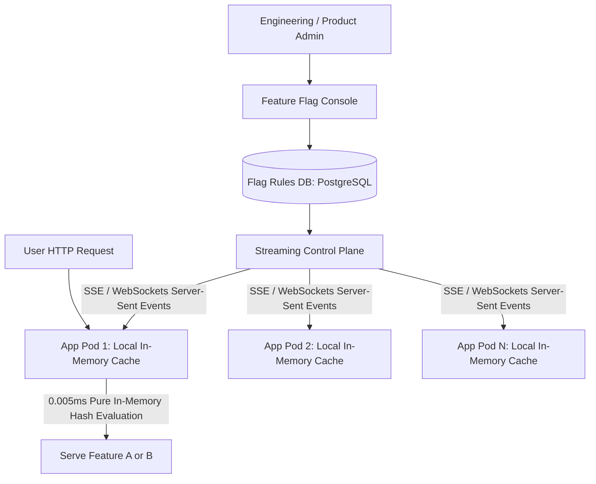

# Design a Distributed Feature Flag Service (LaunchDarkly)

A low-latency, mission-critical feature flagging and configuration streaming platform capable of evaluating flags locally in-memory ($< 0.01	ext{ms}$) across thousands of microservices with real-time updates pushed within seconds.

---

## 1. Requirements

### Functional Requirements:
1. Boolean toggles and multivariate feature flags.
2. Percentage-based gradual rollouts (e.g., enable for 10% of users).
3. Contextual targeting rules (e.g., `country == 'CA' AND app_version >= '2.4.0'`).
4. Real-time updates delivered to all microservices within 2 seconds.

### Non-Functional Requirements:
- **Ultra-Low Evaluation Latency**: In-memory evaluation $< 0.01	ext{ms}$ (must never make network calls during request paths).
- **High Resilience**: If control plane goes down, application pods keep using cached rules safely.

---

## 2. Deterministic Bucketing Algorithm (Consistent Hashing)

To ensure User 42 consistently stays in the 10% rollout bucket:
$$	ext{Bucket} = 	ext{MurmurHash3}(	ext{user\_id} + "	ext{flag\_key}") \pmod{100}$$
If the rollout threshold is 25%, any user whose bucket value is $< 25$ receives the new feature. As the rollout increases to 50%, all previously enabled users remain enabled without storing state in a database!

---

## 3. Real-Time Streaming via Server-Sent Events (SSE)

Application SDKs maintain a persistent HTTP Server-Sent Events (SSE) connection to the control plane.
- When an operator flips a flag in the dashboard, the control plane broadcasts a small JSON delta payload over the SSE stream.
- The SDK updates its internal in-memory hash map instantly with zero container restarts.

---

## 4. Key Takeaways

- Never evaluate feature flags via remote HTTP calls; always evaluate locally in RAM using SDK-managed caches.
- Use MurmurHash3 for deterministic, stateless percentage rollouts.
- Push configuration updates using Server-Sent Events (SSE).
